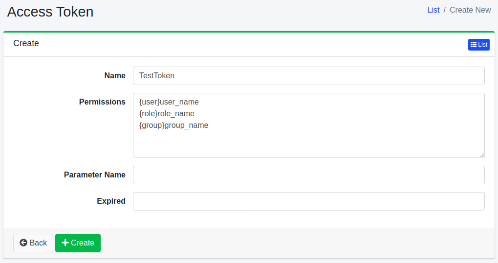

============
Zugriffstoken
============

Übersicht
=========

Die Konfigurationsseite für Zugriffstoken verwaltet Zugriffstoken.

Verwaltung
==========

Anzeige
-------

Um die Konfigurationsübersichtsseite für Zugriffstoken zu öffnen, klicken Sie im linken Menü auf [System > Zugriffstoken].

|image0|

Klicken Sie auf den Konfigurationsnamen, um ihn zu bearbeiten.

Konfiguration erstellen
-----------------------

Um die Konfigurationsseite für Zugriffstoken zu öffnen, klicken Sie auf die Schaltfläche „Neu erstellen".

|image1|

Konfigurationsparameter
-----------------------

Name
::::

Geben Sie einen Namen an, um dieses Zugriffstoken zu beschreiben.

Berechtigung
::::::::::::

Legen Sie die Berechtigung für das Zugriffstoken fest.
Geben Sie diese im Format „{user|group|role}name" an.
Um beispielsweise Suchergebnisse für Benutzer anzuzeigen, die zur Gruppe „developer" gehören, legen Sie die Berechtigung auf „{group}developer" fest.

Parametername
:::::::::::::

Geben Sie den Namen des Anforderungsparameters an, wenn Sie die Berechtigung als Suchabfrage angeben.

Ablaufdatum
:::::::::::

Geben Sie das Ablaufdatum des Zugriffstokens an.

Konfiguration löschen
---------------------

Klicken Sie auf den Konfigurationsnamen auf der Übersichtsseite und dann auf die Schaltfläche „Löschen". Es wird ein Bestätigungsbildschirm angezeigt.
Klicken Sie auf die Schaltfläche „Löschen", um die Konfiguration zu löschen.

.. |image0| image:: ../../../resources/images/en/15.3/admin/accesstoken-1.png

