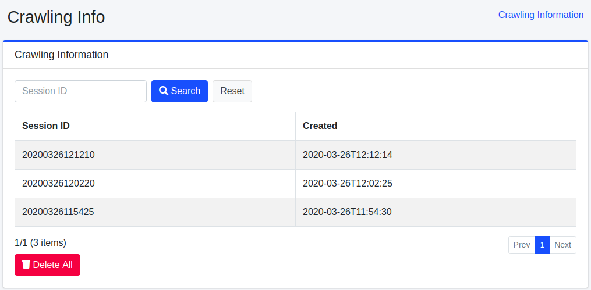
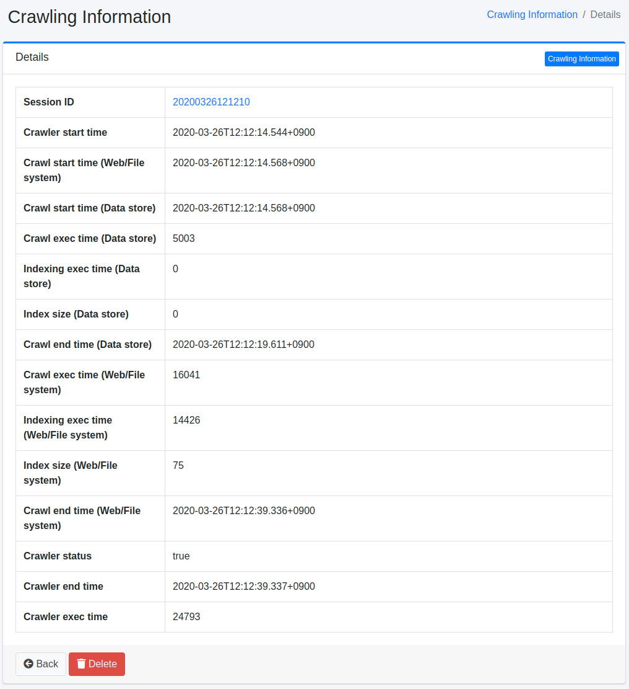

==================
Crawl-Informationen
==================

Übersicht
=========

Die Crawl-Ausführungsergebnisse werden aufgezeichnet, und Crawl-Informationen können auf diesem Verwaltungsbildschirm überprüft werden.

Verwaltung
==========

Übersicht
=========

Jedes Mal, wenn ein Crawl ausgeführt wird, wird er als Crawl-Information aufgezeichnet.
In der Übersicht können Sie den Sitzungsnamen und die Ausführungszeit des durchgeführten Crawls überprüfen.
Um Details der Crawl-Informationen anzuzeigen, klicken Sie auf die entsprechende Crawl-Information.

|image0|

Details
=======

Durch Klicken auf die Sitzungs-ID der Crawl-Informationen in der Übersicht werden die Details der entsprechenden Crawl-Informationen angezeigt.

|image1|

Parameterliste
--------------

Sitzungs-ID
:::::::::::

Die Sitzungs-ID bei der Crawl-Ausführung.

Crawler-Startzeit
:::::::::::::::::

Die Uhrzeit, zu der der gesamte Crawl gestartet wurde.

Crawl-Startzeit (Web/Datei)
:::::::::::::::::::::::::::

Die Uhrzeit, zu der das Web- und Dateisystem-Crawling gestartet wurde.

Crawl-Startzeit (Datenspeicher)
::::::::::::::::::::::::::::::::

Die Uhrzeit, zu der das Datenspeicher-Crawling gestartet wurde.

Crawl-Endzeit (Web/Datei)
:::::::::::::::::::::::::

Die Uhrzeit, zu der das Web- und Dateisystem-Crawling beendet wurde.

Crawl-Ausführungszeit (Datenspeicher)
::::::::::::::::::::::::::::::::::::::

Die Ausführungszeit des Datenspeicher-Crawlings (in Millisekunden).

Indizierungs-Ausführungszeit (Datenspeicher)
:::::::::::::::::::::::::::::::::::::::::::::

Die Zeit, die für die Indizierung der Web- und Dateisystem-Crawl-Ergebnisse benötigt wurde (in Millisekunden).

Indexgröße (Datenspeicher)
::::::::::::::::::::::::::

Die Anzahl der indizierten Dokumente.

Crawl-Endzeit (Datenspeicher)
::::::::::::::::::::::::::::::

Die Uhrzeit, zu der das Datenspeicher-Crawling beendet wurde.

Crawler-Status
::::::::::::::

Ob der Crawl erfolgreich war oder nicht.

Crawler-Endzeit
:::::::::::::::

Die Uhrzeit, zu der der gesamte Crawl beendet wurde.

Crawler-Ausführungszeit
:::::::::::::::::::::::

Die Ausführungszeit des gesamten Crawls (in Millisekunden).

