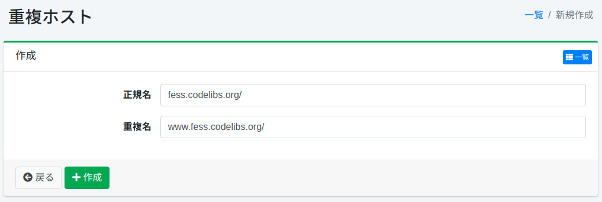

================
Duplikat-Hosts
================

Übersicht
=========

Hier wird die Konfiguration von Duplikat-Hosts erläutert.
Duplikat-Hosts werden verwendet, wenn Sie verschiedene Hostnamen beim Crawlen als identisch behandeln möchten.
Zum Beispiel können Sie dies verwenden, wenn Sie www.example.com und example.com als dieselbe Site behandeln möchten.

Verwaltung
==========

Anzeige
-------

Um die Übersichtsseite für die Duplikat-Host-Konfiguration zu öffnen, klicken Sie im linken Menü auf [Crawler > Duplikat-Hosts].

|image0|

Klicken Sie auf den Konfigurationsnamen, um ihn zu bearbeiten.

Konfiguration erstellen
-----------------------

Um die Duplikat-Host-Konfigurationsseite zu öffnen, klicken Sie auf die Schaltfläche „Neu erstellen".

|image1|

Konfigurationsparameter
-----------------------

Kanonischer Name
::::::::::::::::

Geben Sie den kanonischen Hostnamen an. Duplikat-Hostnamen werden durch den kanonischen Hostnamen ersetzt.

Duplikat-Name
:::::::::::::

Geben Sie den duplizierenden Hostnamen an. Geben Sie den Hostnamen an, der ersetzt werden soll.

Konfiguration löschen
---------------------

Klicken Sie auf den Konfigurationsnamen auf der Übersichtsseite und dann auf die Schaltfläche „Löschen". Es wird ein Bestätigungsbildschirm angezeigt.
Klicken Sie auf die Schaltfläche „Löschen", um die Konfiguration zu löschen.

.. |image0| image:: ../../../resources/images/ja/15.3/admin/duplicatehost-1.png

