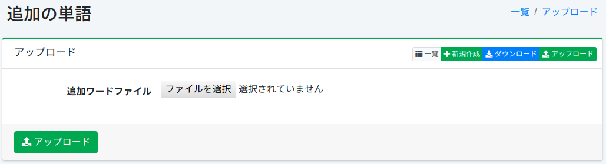

===============
Zusätzliche Wörter
===============

Übersicht
=========

Hier wird die Konfiguration zusätzlicher Wörter für Vorschläge erläutert. Vorschläge werden entsprechend den Suchbegriffen angezeigt, aber Sie können zusätzliche Wörter hinzufügen.

Verwaltung
==========

Anzeige
-------

Um die Übersichtsseite für die Konfiguration zusätzlicher Wörter zu öffnen, klicken Sie im linken Menü auf [Vorschläge > Zusätzliche Wörter].

|image0|

Klicken Sie auf den Konfigurationsnamen, um ihn zu bearbeiten.

Konfiguration erstellen
-----------------------

Um die Konfigurationsseite für zusätzliche Wörter zu öffnen, klicken Sie auf die Schaltfläche „Neu erstellen".

|image1|

Konfigurationsparameter
-----------------------

Wort
::::

Geben Sie das Wort an, das als Vorschlagskandidat angezeigt werden soll.

Lesung
::::::

Geben Sie die Lesung des Vorschlagskandidatenworts an.

Berechtigung
::::::::::::

Legen Sie Rolleninformationen für das Wort fest.
Nur Benutzer mit der festgelegten Rolle können das Wort in den Vorschlägen sehen.

Label
:::::

Legen Sie ein Label für das Wort fest.
Wenn ein anderes als das festgelegte Label ausgewählt ist, wird das Wort nicht in den Vorschlägen angezeigt.

Boost-Wert
::::::::::

Legen Sie einen Boost-Wert für das Wort fest.

Konfiguration löschen
---------------------

Klicken Sie auf den Konfigurationsnamen auf der Übersichtsseite und dann auf die Schaltfläche „Löschen". Es wird ein Bestätigungsbildschirm angezeigt.
Klicken Sie auf die Schaltfläche „Löschen", um die Konfiguration zu löschen.

Download
========

Laden Sie registrierte Wörter im CSV-Format herunter.

|image2|

CSV-Inhalt
----------

Zeile 1 ist die Kopfzeile.
Ab Zeile 2 werden die zusätzlichen Wörter aufgeführt.

::

"SuggestWord","Reading","Role","Label","Boost"
"fess","ふぇす","role1","label1","100"

Upload
======

Registrieren Sie Wörter im CSV-Format.

|image3|

CSV-Inhalt
----------

Zeile 1 ist die Kopfzeile.
Ab Zeile 2 beschreiben Sie die zusätzlichen Wörter.

::

"SuggestWord","Reading","Role","Label","Boost"
"fess","ふぇす","role1","label1","100"

.. |image0| image:: ../../../resources/images/ja/15.3/admin/elevateword-1.png
.. |image1| image:: ../../../resources/images/ja/15.3/admin/elevateword-2.png
.. |image2| image:: ../../../resources/images/ja/15.3/admin/elevateword-3.png

