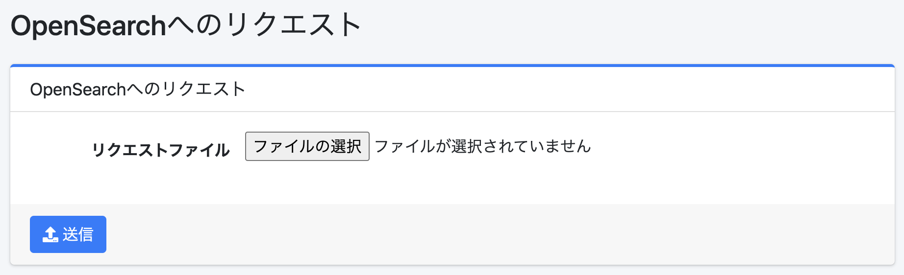

==================
Abfrageanforderung
==================

Übersicht
=========

Auf dieser Seite können Sie JSON-Datei-Abfrageanforderungen an OpenSearch senden.

|image0|

Bedienung
=========

Anforderung senden
------------------

Nach der Anmeldung als Administrator geben Sie /admin/esreq/ als URL-Pfad ein.
Erstellen Sie die Abfrageanforderung, die Sie an OpenSearch senden möchten, als JSON-Datei, wählen Sie diese JSON-Datei als „Anforderungsdatei" aus und klicken Sie auf die Schaltfläche „Senden", um die Anforderung an OpenSearch zu senden.
Die Antwort wird als Datei heruntergeladen.

Konfigurationsparameter
-----------------------

Anforderungsdatei
:::::::::::::::::

Geben Sie eine JSON-Datei an, die die Abfrage-DSL beschreibt.
Zum Beispiel könnte der Inhalt der JSON-Datei wie folgt aussehen:

::

    POST /_search
    {
      "query": {
        "match_all": {}
      }
    }

