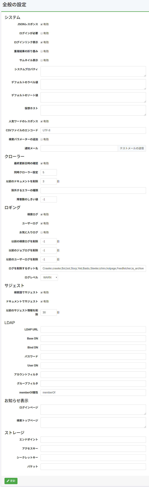

=========
Allgemein
=========

Übersicht
=========

Auf dieser Verwaltungsseite können Sie die Konfiguration von |Fess| verwalten.
Sie können verschiedene Konfigurationen von |Fess| ändern, ohne |Fess| neu zu starten.

|image0|

Konfigurationsinhalt
====================

System
------

JSON-Antwort
::::::::::::

Gibt an, ob die JSON-API aktiviert werden soll.

Anmeldung erforderlich
::::::::::::::::::::::

Gibt an, ob eine Anmeldung für die Suchfunktion erforderlich ist.

Anmeldelink anzeigen
::::::::::::::::::::

Konfiguriert, ob auf dem Suchbildschirm ein Link zur Anmeldeseite angezeigt werden soll.

Doppelte Ergebnisse zusammenklappen
::::::::::::::::::::::::::::::::::::

Konfiguriert, ob das Zusammenklappen doppelter Ergebnisse aktiviert werden soll.

Thumbnail-Anzeige
:::::::::::::::::

Konfiguriert, ob die Thumbnail-Anzeige aktiviert werden soll.

Standard-Label-Wert
:::::::::::::::::::

Beschreiben Sie den Label-Wert, der standardmäßig zur Suchbedingung hinzugefügt werden soll.
Um ihn für Rollen oder Gruppen anzugeben, fügen Sie „role:" oder „group:" hinzu, wie z. B. „role:admin=label1".

Standard-Sortierwert
::::::::::::::::::::

Beschreiben Sie den Sortierwert, der standardmäßig zur Suchbedingung hinzugefügt werden soll.
Um ihn für Rollen oder Gruppen anzugeben, fügen Sie „role:" oder „group:" hinzu, wie z. B. „role:admin=content_length.desc".

Virtueller Host
:::::::::::::::

Konfigurieren Sie den virtuellen Host.
Weitere Details finden Sie unter :doc:`Virtueller Host im Konfigurationshandbuch <../config/virtual-host>`.

Beliebte Wörter-Antwort
:::::::::::::::::::::::

Gibt an, ob die API für beliebte Wörter aktiviert werden soll.

CSV-Datei-Kodierung
:::::::::::::::::::

Geben Sie die Kodierung für heruntergeladene CSV-Dateien an.

Suchparameter hinzufügen
::::::::::::::::::::::::

Aktivieren Sie dies, wenn Sie Parameter an die Suchergebnisanzeige übergeben möchten.

Benachrichtigungs-E-Mail
::::::::::::::::::::::::

Geben Sie die E-Mail-Adresse an, die bei Abschluss des Crawls benachrichtigt werden soll.
Mehrere Adressen können durch Kommas getrennt angegeben werden. Ein E-Mail-Server ist erforderlich.

Crawler
-------

Letztes Änderungsdatum überprüfen
::::::::::::::::::::::::::::::::::

Aktivieren Sie dies für differenzielles Crawling.

Gleichzeitige Crawler-Konfigurationen
::::::::::::::::::::::::::::::::::::::

Geben Sie die Anzahl der gleichzeitig auszuführenden Crawl-Konfigurationen an.

Vorherige Dokumente löschen
::::::::::::::::::::::::::::

Geben Sie die Anzahl der Tage für die Gültigkeitsdauer nach der Indizierung an.

Auszuschließende Fehlertypen
::::::::::::::::::::::::::::

Fehler-URLs, die den Schwellenwert überschreiten, werden vom Crawlen ausgeschlossen, aber hier angegebene Ausnahmenamen werden auch dann gecrawlt, wenn sie den Schwellenwert überschreiten.

Fehlerzahl-Schwellenwert
::::::::::::::::::::::::

Wenn ein zu crawlendes Dokument mehr als die hier angegebene Anzahl in Fehler-URLs aufgezeichnet wurde, wird es beim nächsten Crawl ausgeschlossen.

Protokollierung
---------------

Suchprotokoll
:::::::::::::

Gibt an, ob die Suchprotokollierung aktiviert werden soll.

Benutzerprotokoll
:::::::::::::::::

Gibt an, ob die Benutzerprotokollierung aktiviert werden soll.

Favoritenprotokoll
::::::::::::::::::

Gibt an, ob die Favoritenprotokollierung aktiviert werden soll.

Vorherige Suchprotokolle löschen
:::::::::::::::::::::::::::::::::

Löscht Suchprotokolle, die älter als die angegebene Anzahl von Tagen sind.

Vorherige Jobprotokolle löschen
::::::::::::::::::::::::::::::::

Löscht Jobprotokolle, die älter als die angegebene Anzahl von Tagen sind.

Vorherige Benutzerprotokolle löschen
:::::::::::::::::::::::::::::::::::::

Löscht Benutzerprotokolle, die älter als die angegebene Anzahl von Tagen sind.

Bot-Namen zum Löschen von Protokollen
::::::::::::::::::::::::::::::::::::::

Geben Sie Bot-Namen an, die aus Suchprotokollen ausgeschlossen werden sollen.

Protokollebene
::::::::::::::

Geben Sie die Protokollebene für fess.log an.

Vorschlag
---------

Vorschlag aus Suchbegriffen
:::::::::::::::::::::::::::

Gibt an, ob Vorschlagskandidaten aus Suchprotokollen generiert werden sollen.

Vorschlag aus Dokumenten
::::::::::::::::::::::::

Gibt an, ob Vorschlagskandidaten aus indizierten Dokumenten generiert werden sollen.

Vorherige Vorschlagsinformationen löschen
::::::::::::::::::::::::::::::::::::::::::

Löscht Vorschlagsdaten, die älter als die angegebene Anzahl von Tagen sind.

LDAP
----

LDAP-URL
::::::::

Geben Sie die URL des LDAP-Servers an.

Basis-DN
::::::::

Geben Sie den Basis-Distinguished-Name für die Anmeldung am Suchbildschirm an.

Bind-DN
:::::::

Geben Sie den Bind-DN des Administrators an.

Passwort
::::::::

Geben Sie das Passwort für den Bind-DN an.

Benutzer-DN
:::::::::::

Geben Sie den Distinguished-Name des Benutzers an.

Kontofilter
:::::::::::

Geben Sie den Common Name oder die UID des Benutzers an.

Gruppenfilter
:::::::::::::

Geben Sie die Filterbedingung für abzurufende Gruppen an.

memberOf-Attribut
:::::::::::::::::

Geben Sie den memberOf-Attributnamen an, der auf dem LDAP-Server verfügbar ist.
Für Active Directory ist es memberOf.
Für andere LDAP-Server kann es isMemberOf sein.

Benachrichtigungsanzeige
------------------------

Anmeldeseite
::::::::::::

Beschreiben Sie die Nachricht, die auf dem Anmeldebildschirm angezeigt werden soll.

Such-Startseite
:::::::::::::::

Beschreiben Sie die Nachricht, die auf dem Such-Startbildschirm angezeigt werden soll.

Speicher
--------

Nach der Konfiguration dieser Elemente wird das Menü [System > Speicher] im linken Menü angezeigt.
Informationen zur Dateiverwaltung finden Sie unter :doc:`Speicher <../admin/storage-guide>`.

Endpunkt
::::::::

Geben Sie die Endpunkt-URL des MinIO-Servers an.

Zugriffsschlüssel
:::::::::::::::::

Geben Sie den Zugriffsschlüssel des MinIO-Servers an.

Geheimer Schlüssel
::::::::::::::::::

Geben Sie den geheimen Schlüssel des MinIO-Servers an.

Bucket
::::::

Geben Sie den zu verwaltenden Bucket-Namen an.

Beispiele
=========

LDAP-Konfigurationsbeispiele
-----------------------------

.. tabularcolumns:: |p{4cm}|p{4cm}|p{4cm}|
.. list-table:: LDAP/Active Directory-Konfiguration
   :header-rows: 1

   * - Name
     - Wert (LDAP)
     - Wert (Active Directory)
   * - LDAP-URL
     - ldap://SERVERNAME:389
     - ldap://SERVERNAME:389
   * - Basis-DN
     - cn=Directory Manager
     - dc=fess,dc=codelibs,dc=org
   * - Bind-DN
     - uid=%s,ou=People,dc=fess,dc=codelibs,dc=org
     - manager@fess.codelibs.org
   * - Benutzer-DN
     - uid=%s,ou=People,dc=fess,dc=codelibs,dc=org
     - %s@fess.codelibs.org
   * - Kontofilter
     - cn=%s oder uid=%s
     - (&(objectClass=user)(sAMAccountName=%s))
   * - Gruppenfilter
     -
     - (member:1.2.840.113556.1.4.1941:=%s)
   * - memberOf
     - isMemberOf
     - memberOf

.. pdf            :height: 940 px
