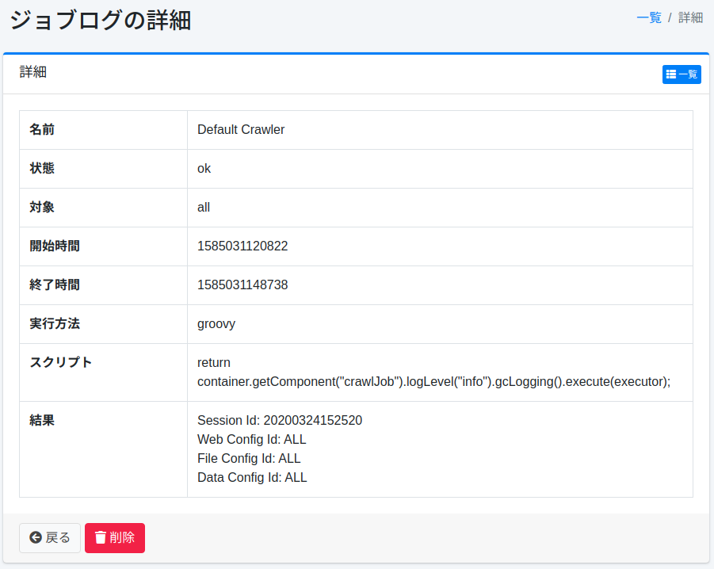

=========
Jobprotokoll
=========

Übersicht
=========

Zeigt die Ergebnisse ausgeführter Jobs als Liste an.

Verwaltung
==========

Anzeige
-------

Um die Jobprotokoll-Überprüfungsseite zu öffnen, klicken Sie im linken Menü auf [Systeminformationen > Jobprotokoll].

|image0|

Jobprotokoll-Details
--------------------

Sie können den Protokollinhalt des Jobs überprüfen. Es werden Jobname, Status, Start-/Abschlusszeit, Ergebnis usw. angezeigt.

|image1|

Name
::::

Der Name des ausgeführten Jobs.

Status
::::::

Das Ausführungsergebnis des Jobs.

Ziel
::::

Das Ziel, für das der Job ausgeführt wird.

Startzeit
:::::::::

Die UNIX-Zeit, zu der der Job gestartet wurde.

Endzeit
:::::::

Die UNIX-Zeit, zu der der Job beendet wurde.

Ausführungsmethode
::::::::::::::::::

Die Ausführungsumgebung, in der der Job ausgeführt wurde.

Skript
::::::

Der Ausführungsinhalt des Jobs.

Ergebnis
::::::::

Das Ausführungsergebnis des Jobs.

.. |image0| image:: ../../../resources/images/ja/15.3/admin/joblog-1.png

