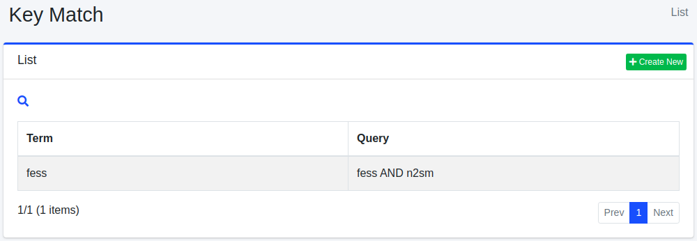

===========
Schlüsselübereinstimmung
===========

Übersicht
=========

Hier wird die Konfiguration der Schlüsselübereinstimmung erläutert.
Durch die Konfiguration der Schlüsselübereinstimmung können Sie Dokumente in den Suchergebnissen höher positionieren, wenn nach registrierten Suchbegriffen gesucht wird.
Eine häufige Verwendung ist Werbung.

Verwaltung
==========

Anzeige
-------
Um die Konfigurationsübersichtsseite für Schlüsselübereinstimmungen zu öffnen, klicken Sie im linken Menü auf [Crawler > Schlüsselübereinstimmung].

|image0|

Klicken Sie auf den Konfigurationsnamen, um ihn zu bearbeiten.

Konfiguration erstellen
-----------------------

Um die Konfigurationsseite für Schlüsselübereinstimmungen zu öffnen, klicken Sie auf die Schaltfläche „Neu erstellen".

|image1|

Konfigurationsparameter
-----------------------

Suchbegriff
:::::::::::

Die Gewichtung wird nur in Suchergebnissen angewendet, wenn nach diesem Suchbegriff gesucht wird.

Abfrage
:::::::

Zieldokumente, die höher positioniert werden sollen, werden durch die Suchabfrage bestimmt.

Größe
:::::

Geben Sie die maximale Anzahl von Dokumenten an, die mit der Abfrage übereinstimmen.

Boost-Wert
::::::::::

Geben Sie den Gewichtungswert für Dokumente an.

Virtueller Host
:::::::::::::::

Geben Sie den Hostnamen des virtuellen Hosts an.
Weitere Details finden Sie unter :doc:`Virtueller Host im Konfigurationshandbuch <../config/virtual-host>`.

Konfiguration löschen
---------------------

Klicken Sie auf den Konfigurationsnamen auf der Übersichtsseite und dann auf die Schaltfläche „Löschen". Es wird ein Bestätigungsbildschirm angezeigt.
Klicken Sie auf die Schaltfläche „Löschen", um die Konfiguration zu löschen.

.. |image1| image:: ../../../resources/images/en/15.3/admin/keymatch-2.png
