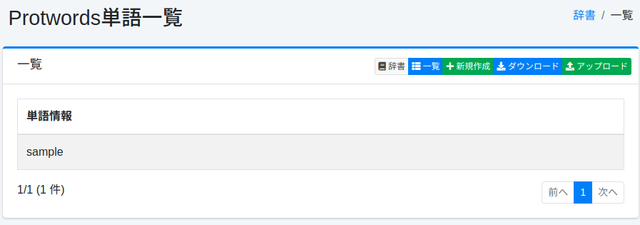

==================
Protwords-Wörterbuch
==================

Übersicht
=========

Sie können Wörter verwalten, die von der Stemming-Verarbeitung ausgeschlossen werden sollen.
Da die Stemming-Verarbeitung grundsätzlich regelbasiert ist, kann eine unbeabsichtigte Normalisierung auftreten.
Beispielsweise wird das Wort Maine (Name eines US-Bundesstaates) zu main normalisiert.

Verwaltung
==========

Anzeige
-------

Um die Protwords-Konfigurationsübersichtsseite zu öffnen, wählen Sie im linken Menü [System > Wörterbuch] aus und klicken Sie dann auf protwords.

|image0|

Klicken Sie auf den Konfigurationsnamen, um ihn zu bearbeiten.

Konfigurationsmethode
---------------------

Um die Protwords-Konfigurationsseite zu öffnen, klicken Sie auf die Schaltfläche „Neu erstellen".

|image1|

Konfigurationsparameter
-----------------------

Wortinformation
:::::::::::::::

Geben Sie Wörter ein, die von der Stemming-Verarbeitung ausgeschlossen werden sollen.

Download
========

Sie können im Protwords-Wörterbuchformat herunterladen.

Upload
======

Sie können im Protwords-Wörterbuchformat hochladen.

.. |image1| image:: ../../../resources/images/ja/15.3/admin/protwords-2.png
