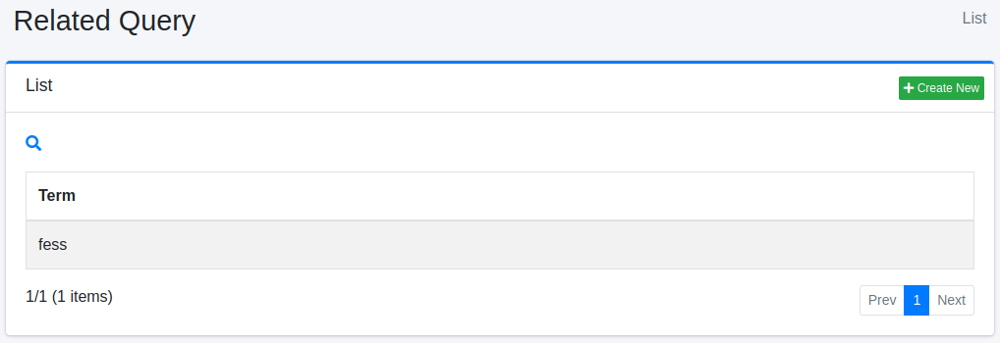
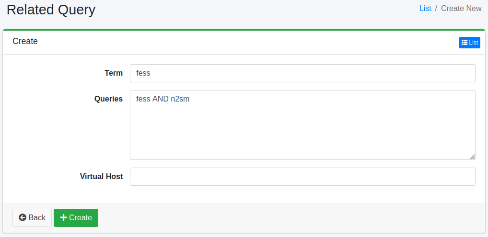

==================
Verwandte Abfragen
==================

Übersicht
=========

Hier wird die Konfiguration verwandter Abfragen erläutert.
Sie können Suchergebnisse mit registrierten verwandten Abfragen verbessern.
Verwandte Abfragen können als Alternativbegriffe für Suchbegriffe verwendet werden.

Verwaltung
==========

Anzeige
-------

Um die Übersichtsseite für die Konfiguration verwandter Abfragen zu öffnen, klicken Sie im linken Menü auf [Crawler > Verwandte Abfragen].

|image0|

Klicken Sie auf den Konfigurationsnamen, um ihn zu bearbeiten.

Konfiguration erstellen
-----------------------

Um die Konfigurationsseite für verwandte Abfragen zu öffnen, klicken Sie auf die Schaltfläche „Neu erstellen".

|image1|

Konfigurationsparameter
-----------------------

Suchbegriff
:::::::::::

Geben Sie den Suchbegriff an, mit dem die Suchabfrage übereinstimmen soll.

Abfrage
:::::::

Geben Sie die Abfrage an.

Virtueller Host
:::::::::::::::

Geben Sie den Hostnamen des virtuellen Hosts an.
Weitere Details finden Sie unter :doc:`Virtueller Host im Konfigurationshandbuch <../config/virtual-host>`.

Konfiguration löschen
---------------------

Klicken Sie auf den Konfigurationsnamen auf der Übersichtsseite und dann auf die Schaltfläche „Löschen". Es wird ein Bestätigungsbildschirm angezeigt.
Klicken Sie auf die Schaltfläche „Löschen", um die Konfiguration zu löschen.

