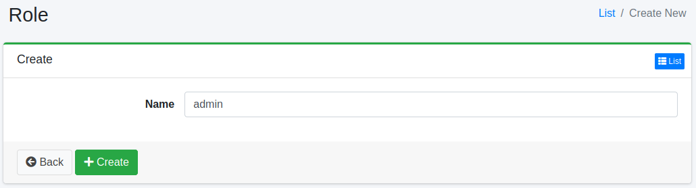

======
Rolle
======

Übersicht
=========

Sie können Rollen verwalten, zu denen Benutzer gehören.
Dies kann beispielsweise bei der LDAP-Integration verwendet werden.

Verwaltung
==========

Anzeige
-------

Um die Rollen-Konfigurationsübersichtsseite zu öffnen, klicken Sie im linken Menü auf [Benutzer > Rolle].

|image0|

Klicken Sie auf den Konfigurationsnamen, um ihn zu bearbeiten.

Konfiguration erstellen
-----------------------

Um die Rollen-Konfigurationsseite zu öffnen, klicken Sie auf die Schaltfläche „Neu erstellen".

|image1|

Konfigurationsparameter
-----------------------

Name
::::

Rollenname.

Konfiguration löschen
---------------------

Klicken Sie auf den Konfigurationsnamen auf der Übersichtsseite und dann auf die Schaltfläche „Löschen". Es wird ein Bestätigungsbildschirm angezeigt.
Klicken Sie auf die Schaltfläche „Löschen", um die Konfiguration zu löschen.

.. |image0| image:: ../../../resources/images/en/15.3/admin/role-1.png

