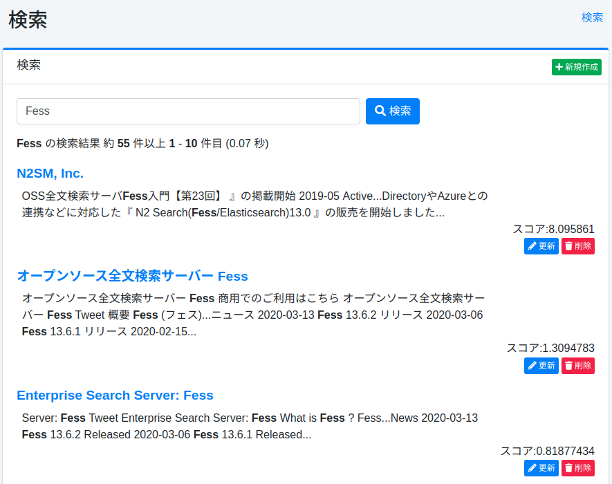

====
Suche
====

Übersicht
=========

Hier wird die Verwaltungssuche erläutert.

Verwaltung
==========

Anzeige
-------

Um die Suchseite zu öffnen, klicken Sie im linken Menü auf [Systeminformationen > Suche].

|image0|

Suchliste
---------

Sie können nach angegebenen Bedingungen suchen.
Im normalen Suchbildschirm werden Rollen- und Browser-Bedingungen implizit hinzugefügt, aber in dieser Verwaltungssuche werden sie nicht hinzugefügt.
Sie können auch bestimmte Dokumente aus dem Index aus den angezeigten Suchergebnissen löschen.

Massenlöschung
--------------

Wenn Sie alle Dokumente aus dem Index löschen möchten, können Sie dies tun, indem Sie „\*:\*" eingeben und auf die Schaltfläche „Alle mit dieser Abfrage löschen" klicken.
Es ist auch möglich, nur Zieldokumente zu löschen, indem Sie Suchbedingungen angeben.

