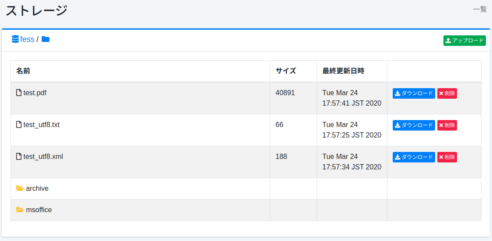

========
Speicher
========

Übersicht
=========

Auf der Speicherseite können Sie Dateien auf MinIO verwalten, einem Amazon S3-kompatiblen Objektspeicher.

Verwaltung
==========

Konfiguration des Objektspeicher-Servers
-----------------------------------------

Öffnen Sie die Speicherkonfiguration unter [System > Allgemein] und konfigurieren Sie die folgenden Elemente:

- Endpunkt: Endpunkt-URL des Speicherservers
- Zugriffsschlüssel: Zugriffsschlüssel des Speicherservers
- Geheimer Schlüssel: Geheimer Schlüssel des Speicherservers
- Bucket: Name des zu verwaltenden Buckets

Anzeige
-------

Um die Objektübersichtsseite zu öffnen, klicken Sie im linken Menü auf [System > Speicher].

|image0|

Name
::::

Der Dateiname des Objekts

Größe
:::::

Die Größe des Objekts

Letztes Änderungsdatum
::::::::::::::::::::::

Das letzte Änderungsdatum des Objekts

Download
--------

Durch Klicken auf die Schaltfläche „Download" können Sie das Objekt herunterladen.

Löschen
-------

Durch Klicken auf die Schaltfläche „Löschen" können Sie das Objekt löschen.

Upload
------

Klicken Sie oben rechts auf die Schaltfläche „Datei hochladen", um das Datei-Upload-Fenster zu öffnen.

Ordner erstellen
----------------

Klicken Sie auf die Schaltfläche „Ordner erstellen" rechts neben der Pfadanzeige, um das Ordnererstellungsfenster zu öffnen. Beachten Sie, dass leere Ordner nicht erstellt werden können.

