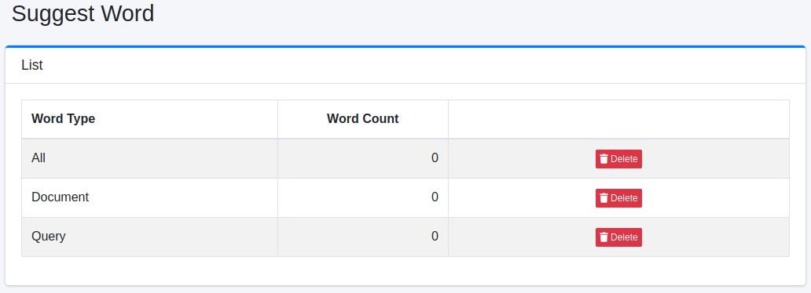

===============
Vorschlagswort
===============

Übersicht
=========

Die Vorschlagswortseite verwaltet Wörter, die in der Schlüsselwortvorschlagsfunktion angezeigt werden.

Verwaltung
==========

Anzeige
-------

Um die Vorschlagswort-Übersichtsseite zu öffnen, klicken Sie im linken Menü auf [Vorschläge > Vorschlagswort].

|image0|

Klicken Sie zum Löschen auf die Schaltfläche „Löschen".

Worttyp
:::::::

- Alle: Alle registrierten Wörter
- Dokument: Aus indizierten Dokumenten generierte Wörter
- Suchbegriff: Aus Suchprotokollen generierte Wörter

Wortanzahl
::::::::::

Anzahl der registrierten Wörter

