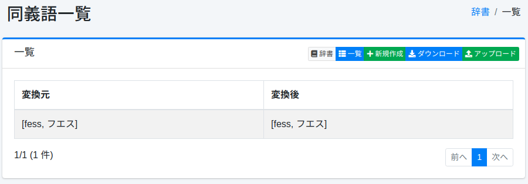
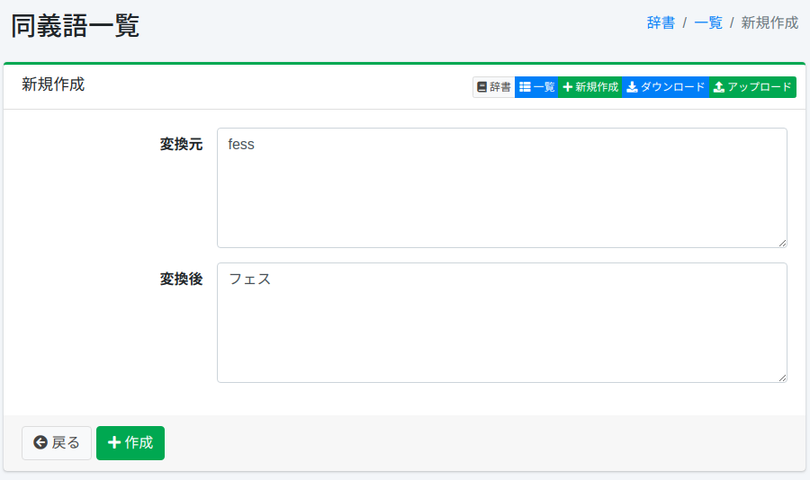

==================
Synonym-Wörterbuch
==================

Übersicht
=========

Sie können Synonyme für Wörter mit derselben Bedeutung (z. B. GB, Gigabyte) verwalten.

Verwaltung
==========

Anzeige
-------

Um die Synonym-Konfigurationsübersichtsseite zu öffnen, wählen Sie im linken Menü [System > Wörterbuch] aus und klicken Sie dann auf synonym.

|image0|

Klicken Sie auf den Konfigurationsnamen, um ihn zu bearbeiten.

Konfigurationsmethode
---------------------

Um die Synonym-Konfigurationsseite zu öffnen, klicken Sie auf die Schaltfläche „Neu erstellen".

|image1|

Konfigurationsparameter
-----------------------

Da die Standardkonfiguration für die Indexerstellung Bi-Gramm ist, müssen Sie darauf achten, dass das konvertierte Wort nicht zu einem einzelnen Zeichen wird.
Außerdem müssen Sie bei der Registrierung von Synonymen wie folgt vorgehen:

* Hiragana als Katakana registrieren
* Kleine Katakana als große Katakana registrieren
* Vollbreiten-Alphanumerika als Halbbreiten-Alphanumerika registrieren
* Synonyme nicht doppelt registrieren

Quelle
::::::

Geben Sie das Wort ein, das als Synonym behandelt werden soll.

Ziel
::::

Erweitern Sie das in der Quelle eingegebene Wort mit dem Zielwort.
Wenn Sie beispielsweise „TV" sowohl als „TV" als auch als „テレビ" behandeln möchten, geben Sie „TV" in der Quelle ein und „TV" und „テレビ" im Ziel.

Download
========

Sie können im Synonym-Wörterbuchformat herunterladen, das von Apache Lucene bereitgestellt wird.

Upload
======

Sie können im Synonym-Wörterbuchformat hochladen, das von Apache Lucene bereitgestellt wird.
Da Synonyme eine Ersetzung einer Wortgruppe durch eine andere Wortgruppe darstellen, werden in der Wörterbuchbeschreibung Kommas (,) und Konvertierung (=>) verwendet.
Um beispielsweise „TV" durch „テレビ" zu ersetzen, verwenden Sie => und schreiben wie folgt:

::

    TV=>テレビ

Um „fess" und „フェス" gleich zu behandeln, schreiben Sie wie folgt:

::

    fess,フエス=>fess,フエス

In solchen Fällen kann => weggelassen und wie folgt geschrieben werden:

::

    fess,フエス

