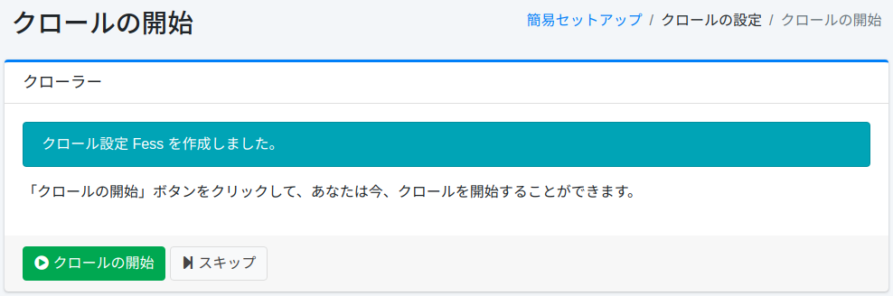

====================
Konfigurations-Assistent
====================

Übersicht
=========

Die Assistentenseite bietet ein einfaches Setup-Tool zum Registrieren von Crawl-Konfigurationen.

Einfaches Setup
---------------

Diese Seite ist die Startseite zum Registrieren von Crawl-Konfigurationen.

|image0|

Crawl-Konfiguration
-------------------

Auf dieser Seite können Sie Crawl-Konfigurationen erstellen.

|image1|

Konfigurationsparameter
-----------------------

Name
::::

Geben Sie den Konfigurationsnamen an (z. B. Fess-Site).

Crawl-Pfad
::::::::::

Geben Sie die Start-URL oder den Dateipfad für das Crawling an (z. B. https://fess.codelibs.org/).

Maximale Zugriffszahl
:::::::::::::::::::::

Legen Sie die Obergrenze der zu crawlenden Seiten fest.

Tiefe
:::::

Legen Sie die Tiefe beim Verfolgen von Links fest, die in gecrawlten Dokumenten enthalten sind.

Crawler
-------

Um den |Fess| Crawler zu starten, klicken Sie auf die Schaltfläche „Crawlen starten". Wenn Sie noch nicht crawlen möchten, klicken Sie auf die Schaltfläche „Überspringen".

|image2|

.. |image0| image:: ../../../resources/images/ja/15.3/admin/wizard-1.png
.. |image1| image:: ../../../resources/images/ja/15.3/admin/wizard-2.png

