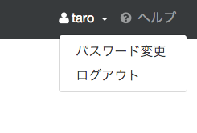
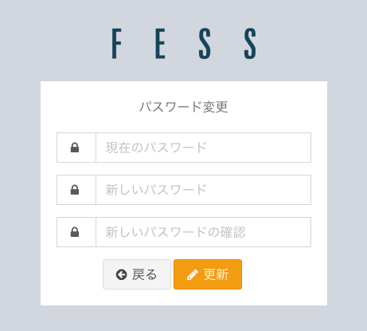

==================
Rollenbasierte Suche
==================

|Fess| bietet Benutzerverwaltungsfunktionen, die es Benutzern ermöglichen, die rollenbasierte Suche durch Anmeldung zu nutzen. Von |Fess| verwaltete Benutzer können nach der Anmeldung die rollenbasierte Suche nutzen und ihr Passwort ändern.

Suchmethode
-------------

Wenn Rollen festgelegt sind und Crawling sowie Indizierung durchgeführt wurden, können Suchergebnisse nur Benutzern angezeigt werden, die die entsprechenden Rollen besitzen.
Wenn ein Benutzer angemeldet ist, wird die Suche basierend auf den zugehörigen Rollen durchgeführt.

Passwort ändern
-----------------

Nach der Anmeldung können Sie durch Klicken auf den oben im Suchbildschirm angezeigten Benutzernamen das Menü zur Passwortänderung anzeigen.

|image0|

Durch Klicken auf "Passwort ändern" wird der Bildschirm zur Passwortänderung angezeigt.

|image1|

Geben Sie das aktuelle Passwort und das neue Passwort ein und klicken Sie auf die Schaltfläche "Aktualisieren", um das Passwort zu aktualisieren.
Nach der Passwortänderung können Sie durch Klicken auf die Schaltfläche "Zurück" zum Suchbildschirm zurückkehren.

Abmelden
----------

Wenn Sie angemeldet sind, können Sie sich abmelden, indem Sie auf den oben im Suchbildschirm angezeigten Benutzernamen klicken und aus dem Menü "Abmelden" auswählen.

.. pdf   :width: 200 px

.. pdf   :width: 300 px

