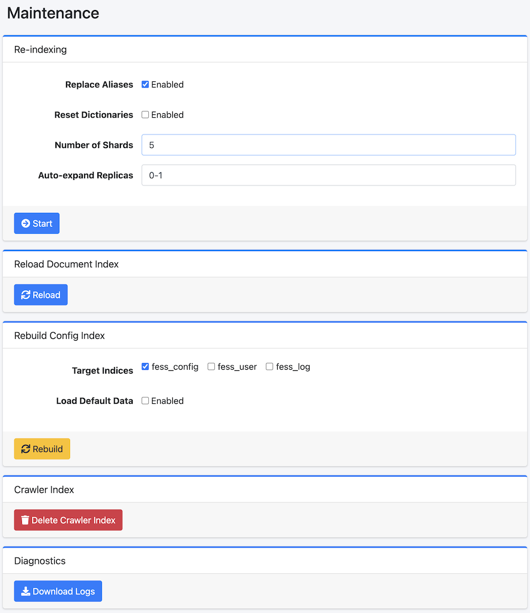

=========
Wartung
=========

Übersicht
=========

Die Wartungsseite wird verwendet, wenn Systemdatenoperationen ausgeführt werden.

|image0|

Bedienung
=========

Neuindizierung
--------------

Sie können einen neuen Index aus dem vorhandenen Fess-Index neu erstellen.
Führen Sie dies aus, wenn Sie das Index-Mapping ändern möchten.

Konfigurationsparameter
-----------------------

Alias aktualisieren
:::::::::::::::::::

Durch Aktivierung können Sie nach Abschluss der Neuindizierung die Aliasse fess.search und fess.update, die dem vorhandenen Index zugewiesen sind, auf den neuen Index umstellen.

Wörterbuch initialisieren
:::::::::::::::::::::::::

Durch Aktivierung können Sie die Wörterbuchkonfiguration initialisieren.

Shard-Anzahl
::::::::::::

Sie können die OpenSearch-Shard-Anzahl (index.number_of_shards) angeben.

Maximale Replikatanzahl
:::::::::::::::::::::::

Sie können die maximale OpenSearch-Replikatanzahl (index.auto_expand_replicas) angeben.

Konfigurationsindex neu erstellen
----------------------------------

Sie können Konfigurationsindizes (fess_config, fess_user, fess_log) mit den neuesten Mappings neu erstellen.
Dieser Vorgang wird im Hintergrund ausgeführt. Bitte erstellen Sie vor der Ausführung eine Sicherungskopie Ihrer Konfiguration.

Zielindizes
:::::::::::

Wählen Sie die neu zu erstellenden Indizes aus. Sie können aus fess_config, fess_user und fess_log wählen.

Standarddaten laden
:::::::::::::::::::

Durch Aktivierung werden bei der Neuerstellung Standarddaten geladen. Vorhandene Dokumente werden nicht überschrieben.

Dokumentindex neu laden
-----------------------

Sie können den Dokumentindex neu laden, um die Indexkonfiguration zu übernehmen.

Crawler-Index
-------------

Sie können den fess_crawler-Index (Crawl-Informationen) löschen.
Führen Sie dies nicht während der Crawler-Ausführung aus.

Diagnose
--------

Sie können Protokolldateien im ZIP-Format herunterladen.

