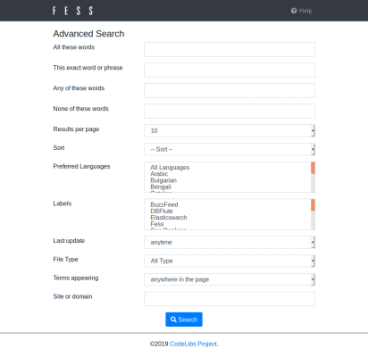

==================
Erweiterte Suche
==================

Der erweiterte Suchbildschirm ermöglicht komplexere Suchen durch die Kombination mehrerer Bedingungen.

Verwendung
-----------

Der erweiterte Suchbildschirm wird über den Link "Erweiterte Suche" in den Suchoptionen des Suchbildschirms aufgerufen. Wird er vom Suchergebnisbildschirm aus geöffnet, werden die bereits eingegebenen Suchbegriffe in das Feld "Alle Wörter enthalten" übernommen.

|image0|

Geben Sie in jedem Feld die gewünschten Bedingungen ein und klicken Sie auf die Suchschaltfläche unten auf der Seite. Die mehreren eingegebenen Felder werden zu einer einzigen Suchbedingung kombiniert.

Elementliste
-------------

Alle Wörter enthalten
:::::::::::::::::::::::::

Sucht nach Dokumenten, die alle eingegebenen Wörter enthalten (UND-Suche). Mehrere Wörter können durch Leerzeichen getrennt angegeben werden.

Exakte Übereinstimmung einschließlich Wortreihenfolge
:::::::::::::::::::::::::::::::::::::::::::::::::::::::::::

Sucht nach Dokumenten, die die eingegebene Zeichenkette exakt, einschließlich der Wortreihenfolge, enthalten (Phrasensuche). Da die gesamte Zeichenkette einschließlich der Leerzeichen als eine einzige Phrase behandelt wird, kann sie nicht in einzelne Wörter für die Suche aufgeteilt werden.

Eines der Wörter enthalten
::::::::::::::::::::::::::::::::

Sucht nach Dokumenten, die eines der eingegebenen Wörter enthalten (ODER-Suche). Mehrere Wörter können durch Leerzeichen getrennt angegeben werden.

Auszuschließende Wörter
::::::::::::::::::::::::::::

Sucht nach Dokumenten, die die eingegebenen Wörter nicht enthalten. Mehrere Wörter können durch Leerzeichen getrennt angegeben werden; alle angegebenen Wörter werden aus den Suchergebnissen ausgeschlossen.

Anzahl der Anzeigen
::::::::::::::::::::::

Gibt die Anzahl der pro Seite angezeigten Suchergebnisse an. Sie können zwischen 10, 20, 30, 40, 50 und 100 wählen. Wenn kein Wert angegeben wird, wird die Standardanzahl der Anzeigen (Anfangswert 10) verwendet.

Sortierung
::::::::::::

Gibt das Kriterium für die Sortierung der Suchergebnisse an. Sie können zwischen "nach Punktzahl", "nach Dateiname", "nach Datum", "nach Größe" und "nach letzter Änderung" wählen, jeweils in aufsteigender oder absteigender Reihenfolge. Die Sortierung "nach Klickanzahl" oder "nach Favoritenanzahl" ist verfügbar, wenn die entsprechende Funktion aktiviert ist.

Bevorzugte Sprache
::::::::::::::::::::

Gibt die bevorzugte Sprache für die Suchergebnisse an. Es können mehrere Sprachen ausgewählt werden. Wenn "Alle Sprachen" ausgewählt ist, wird keine bestimmte Sprache bevorzugt.

Label
::::::::

Filtert die Suche nach Label. Es können mehrere Label ausgewählt werden. Es wird nicht angezeigt, wenn keine Label registriert sind oder wenn es keine Label gibt, die der aktuelle Benutzer anzeigen darf.

Aktualisierungsdatum
::::::::::::::::::::::::

Filtert die Suche nach dem Aktualisierungsdatum bzw. -zeitpunkt des Dokuments. Sie können zwischen "Jederzeit", "Letzte 24 Stunden", "Letzte Woche", "Letzter Monat" und "Letztes Jahr" wählen.

Dateiformat
:::::::::::::

Filtert die Suche nach dem Dateiformat des Dokuments. Sie können zwischen "Beliebiges Format", "HTML", "PDF", "MS Word", "MS Excel" und "MS PowerPoint" wählen.

Suchziel
::::::::::

Gibt an, wo gesucht werden soll. Sie können zwischen "Überall auf der Seite", "im Titel der Seite" und "in der URL der Seite" wählen. Wenn "im Titel der Seite" oder "in der URL der Seite" ausgewählt ist, werden die eingegebenen Wörter nur im Titel bzw. in der URL gesucht.

Website oder Domain
::::::::::::::::::::::

Filtert die Suche nach der eingegebenen Website oder Domain. Geben Sie dies an, wenn Sie nur Dokumente durchsuchen möchten, die in einer bestimmten Website oder Domain enthalten sind.

