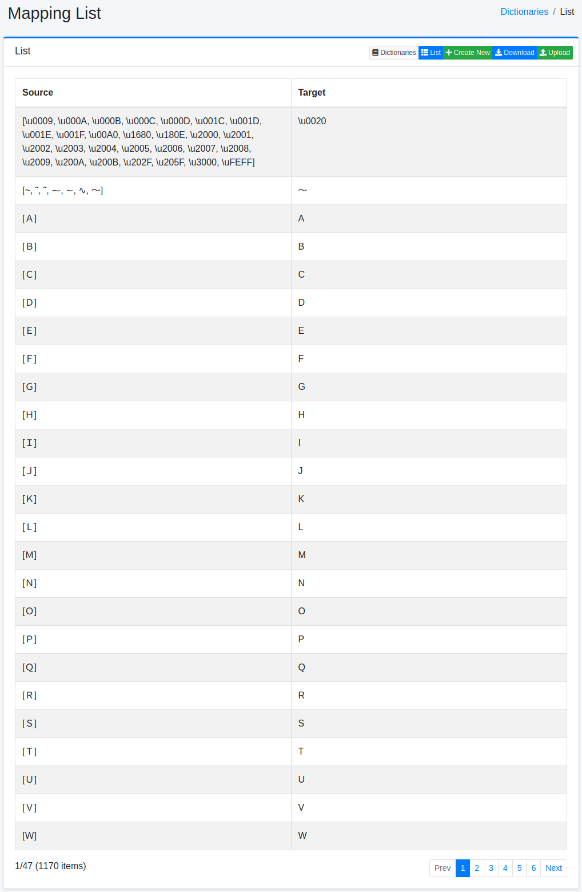
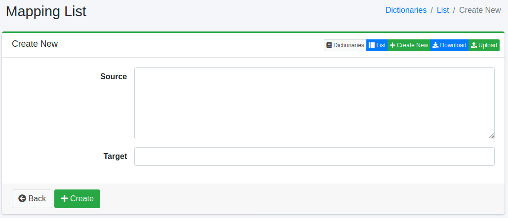

==================
Mapping-Wörterbuch
==================

Übersicht
=========

Bestimmte Zeichen (Symbole, Zeichencodes, Vollbreite/Halbbreite) können auf andere Zeichen gemappt werden.

Verwaltung
==========

Anzeige
-------

Um die Mapping-Konfigurationsübersichtsseite zu öffnen, wählen Sie im linken Menü [System > Wörterbuch] aus und klicken Sie dann auf mapping.

|image0|

Klicken Sie auf den Konfigurationsnamen, um ihn zu bearbeiten.

Konfigurationsmethode
---------------------

Um die Mapping-Konfigurationsseite zu öffnen, klicken Sie auf die Schaltfläche „Neu erstellen".

|image1|

Konfigurationsparameter
-----------------------

Quelle
::::::

Geben Sie die Zeichen (Symbole, Zeichencodes, Vollbreite/Halbbreite) ein, die gemappt werden sollen.

Ziel
::::

Erweitern Sie die in der Quelle eingegebenen Zeichen mit den Zielzeichen.

Download
========

Sie können im Mapping-Wörterbuchformat herunterladen.

Upload
======

Sie können im Mapping-Wörterbuchformat hochladen.

Mitgelieferte Mapping-Wörterbücher
==================================

Das Standard-``mapping.txt`` wird bei der Analyse von Suchfeldern wie ``title`` und ``content``
verwendet. Es vereinheitlicht Hiragana, kleine Kana und Halbbreiten-Katakana zu Vollbreiten-Katakana,
sodass りんご, リンゴ und ﾘﾝｺﾞ einander finden. In |Fess| 15.9 werden zusätzlich folgende
Schreibweisen vereinheitlicht:

- ゐ und ゑ (zu イ und エ), kleine Kana wie ゎ, ゕ, ゖ, ヮ, ヵ, ヶ und ㇰ-ㇿ sowie ゝ und ゞ (zu ヽ und ヾ)
- ヴ, ヴャ, ヴュ und ヴョ, Hiragana ゔ, Halbbreiten-ｳﾞ sowie ウ oder う mit einem kombinierenden
  Stimmhaftigkeitszeichen (U+3099); zum Beispiel wird ラヴ zu ラブ und レヴュー zu レビユー

Außerdem werden ‐ ‑ ‒ – — ― ⁻ ₋ − und －, die direkt nach Kana stehen, als Längungszeichen ー
behandelt (``prolonged_sound_mark_filter``), sodass サ―バ－ und サ−バ‐ サーバー finden. Ein
ASCII-Bindestrich (``-``) und ein Strich nach Kanji, Buchstaben oder Ziffern (東京－大阪,
2026−10−02) werden nicht verändert.

``ja/mapping.txt`` für Japanisch (die ``*_ja``-Felder) lässt Hiragana und kleine Kana unverändert,
weil die morphologische Analyse sie benötigt, und vereinheitlicht nur Schreibweisen wie ヴ.

.. note::

   Diese Einstellungen gelten für einen neu erstellten Dokumentindex. Ein bestehender Index behält
   seine Analyse-Einstellungen und Wörterbücher, bis er neu indexiert wird. Um sie auf einen
   bestehenden Index anzuwenden, indexieren Sie auf der Seite :doc:`maintenance-guide` mit
   aktiviertem „Wörterbücher zurücksetzen“ neu. Das Zurücksetzen überschreibt Änderungen an
   ``mapping.txt`` / ``ja/mapping.txt``, die in der Administrationsoberfläche vorgenommen wurden.

