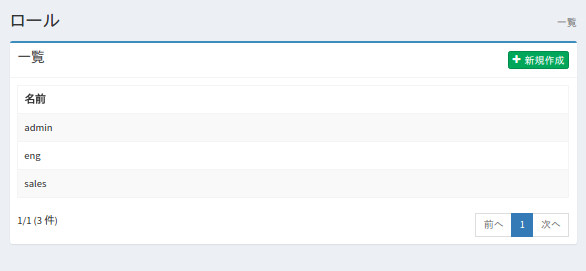
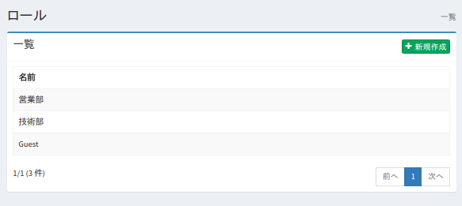
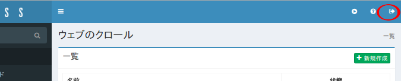
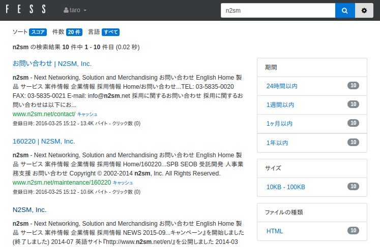
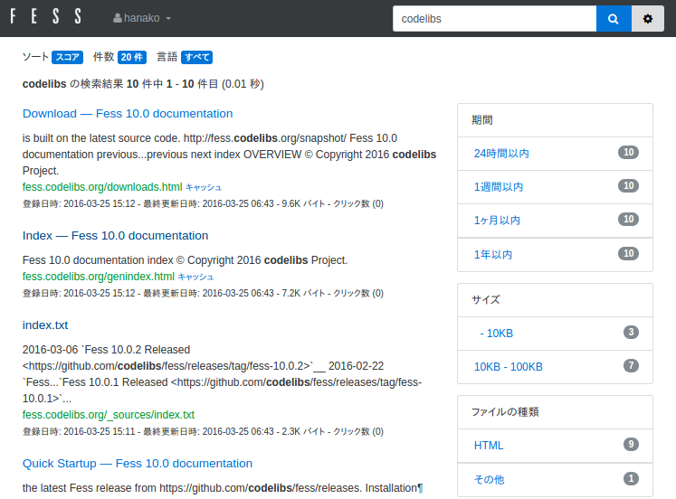

====================================================================
Fess Elasticsearch-basierter Suchserver erstellen ~ Rollenbasierte Suche
====================================================================

Einleitung
========

In diesem Artikel stellen wir die rollenbasierte Suchfunktion vor, eine der charakteristischen Funktionen von Fess.

Dieser Artikel verwendet Fess 15.3.0 zur Erklärung.
Informationen zur Einrichtung von Fess finden Sie in der `Einführung <https://fess.codelibs.org/ja/articles/article-1.html>`__.

Zielgruppe
========

-  Personen, die ein Suchsystem für authentifizierte Systeme wie Portale aufbauen möchten

-  Personen, die eine Suchumgebung entsprechend der Zugriffsrechte aufbauen möchten

Erforderliche Umgebung
==========

Der Inhalt dieses Artikels wurde in folgender Umgebung getestet:

-  Ubuntu 22.04

-  OpenJDK 21

Rollenbasierte Suche
================

Die rollenbasierte Suche von Fess ist eine Funktion, die Suchergebnisse basierend auf den Authentifizierungsinformationen authentifizierter Benutzer unterschiedlich darstellt.
Zum Beispiel sieht Vertriebsmitarbeiter A, der die Vertriebsrolle hat, in den Suchergebnissen Informationen mit der Vertriebsrolle, aber technischer Mitarbeiter B ohne die Vertriebsrolle sieht diese nicht, selbst wenn er sucht.
Mit dieser Funktion können Sie in Portalen oder Single-Sign-On-Umgebungen Suchen nach Abteilungen oder Positionen der angemeldeten Benutzer durchführen.

Die rollenbasierte Suche von Fess kann standardmäßig Suchergebnisse basierend auf von Fess verwalteten Benutzerinformationen unterscheiden.
Darüber hinaus kann sie auch mit Authentifizierungsinformationen von LDAP oder Active Directory integriert werden.
Neben diesen Authentifizierungssystemen können Rolleninformationen auch von folgenden Stellen abgerufen werden:

1. Anfrageparameter

2. Anfrage-Header

3. Cookie

4. J2EE-Authentifizierungsinformationen

Verwendungsweise: Bei Portalservern oder Agent-basierten Single-Sign-On-Systemen können Authentifizierungsinformationen während der Authentifizierung als Cookie für die Domain und den Pfad, auf dem Fess läuft, gespeichert und an Fess übergeben werden.
Bei Reverse-Proxy-basierten Single-Sign-On-Systemen können Authentifizierungsinformationen beim Zugriff auf Fess als Anfrageparameter oder Anfrage-Header hinzugefügt werden, damit Fess die Rolleninformationen abrufen kann.
Durch die Integration mit verschiedenen Authentifizierungssystemen können Suchergebnisse für jeden Benutzer unterschiedlich dargestellt werden.

Konfiguration für die Verwendung der rollenbasierten Suche
====================================

Es wird vorausgesetzt, dass Fess 15.3.0 installiert ist.
Falls noch nicht installiert, installieren Sie es gemäß der `Einführung <https://fess.codelibs.org/ja/articles/article-1.html>`__.

Diesmal erklären wir die Rollensuche mit der Benutzerverwaltungsfunktion von Fess.

Konfigurationsübersicht
----------

Diesmal erstellen wir zwei Rollen: Vertrieb (sales) und Technik (eng). Benutzer taro gehört zur sales-Rolle und kann Suchergebnisse von \https://www.n2sm.net/ erhalten, und Benutzer hanako gehört zur eng-Rolle und kann Suchergebnisse von \https://fess.codelibs.org/ erhalten.

Rollenerstellung
------------

Greifen Sie zunächst auf die Administrationsseite zu.
\http://localhost:8080/admin/

Gehen Sie zu Benutzer > Rollen > Neu erstellen, geben Sie „sales" als Namen ein und erstellen Sie die sales-Rolle.
Erstellen Sie auf die gleiche Weise auch die eng-Rolle.

Rollenliste
|image0|

Crawler-Rollenerstellung
----------------------

Klicken Sie auf Benutzer > Rollen > sales > Neue Crawler-Rolle erstellen.
Geben Sie „Vertrieb" als Namen ein, lassen Sie den Wert bei „sales" und klicken Sie auf [Erstellen].
Dann wird die Vertriebskonfiguration zur Liste unter Crawler > Rollen hinzugefügt.

Registrieren Sie auf die gleiche Weise die Crawler-Rolle für eng mit dem Namen „Technik".

Crawler-Rollenliste
|image1|

Benutzererstellung
--------------

Erstellen Sie unter Benutzer > Benutzer > Neu erstellen die Benutzer taro und hanako mit den folgenden Konfigurationen.

.. tabularcolumns:: |p{4cm}|p{8cm}|
.. list-table::

   * -
     - Taro
     - Hanako
   * - Benutzername
     - taro
     - hanako
   * - Passwort
     - taro
     - hanako
   * - Rolle
     - sales
     - eng

Bestätigung der registrierten Benutzer
------------------

Mit dieser Konfiguration können sich drei Benutzer bei Fess anmelden: admin, taro und hanako.
Bestätigen Sie, dass Sie sich nacheinander anmelden können.
Greifen Sie auf \http://localhost:8080/admin/ zu und melden Sie sich als admin-Benutzer an. Die Administrationsseite wird normal angezeigt.
Melden Sie als nächstes den admin-Benutzer ab. Klicken Sie auf die Schaltfläche oben rechts auf der Administrationsseite.

Abmelde-Schaltfläche
|image2|

Geben Sie Benutzername und Passwort ein und melden Sie sich als taro oder hanako an.
Nach erfolgreicher Anmeldung wird die Suchseite \http://localhost:8080/ angezeigt.

Crawl-Konfiguration hinzufügen
------------------

Registrieren Sie Crawl-Ziele.
Diesmal können Benutzer mit der Vertriebsrolle nur \https://www.n2sm.net/ durchsuchen, und Benutzer mit der Technikrolle können nur \https://fess.codelibs.org/ durchsuchen.
Um diese Crawl-Konfigurationen zu registrieren, klicken Sie auf Crawler > Web > Neu erstellen und erstellen Sie die Web-Crawl-Konfigurationen.
Diesmal verwenden wir die folgenden Konfigurationen. Der Rest ist Standard.

.. tabularcolumns:: |p{4cm}|p{8cm}|
.. list-table::

   * -
     - N2SM
     - Fess
   * - Name
     - N2SM
     - Fess
   * - URL
     - \https://www.n2sm.net/
     - \https://fess.codelibs.org/
   * - URLs zum Crawlen
     - \https://www.n2sm.net/.*
     - \https://fess.codelibs.org/.*
   * - Maximale Zugriffe
     - 10
     - 10
   * - Intervall
     - 3000 Millisekunden
     - 3000 Millisekunden
   * - Rolle
     - Vertrieb
     - Technik

Crawl starten
--------------

Nach der Registrierung der Crawl-Konfiguration klicken Sie unter System > Scheduler > Default Crawler auf [Jetzt starten]. Warten Sie, bis der Crawl abgeschlossen ist.

Suche
----

Nach Abschluss des Crawls greifen Sie auf \http://localhost:8080/ zu und suchen Sie im nicht angemeldeten Zustand nach einem Wort wie „fess". Bestätigen Sie, dass keine Suchergebnisse angezeigt werden.
Melden Sie sich als nächstes als Benutzer taro an und suchen Sie auf die gleiche Weise.
Da Benutzer taro die sales-Rolle hat, werden nur Suchergebnisse von \https://www.n2sm.net/ angezeigt.

Suchseite mit sales-Rolle
|image3|

Melden Sie Benutzer taro ab und melden Sie sich als Benutzer hanako an.
Wenn Sie wie zuvor suchen, hat Benutzer hanako die eng-Rolle, sodass nur Suchergebnisse von \https://fess.codelibs.org/ angezeigt werden.

Suchseite mit eng-Rolle
|image4|

Zusammenfassung
======

Wir haben die rollenbasierte Suche vorgestellt, eine der Sicherheitsfunktionen von Fess.
Wir haben uns hauptsächlich auf die rollenbasierte Suche mit J2EE-Authentifizierungsinformationen konzentriert, aber da die Übergabe von Authentifizierungsinformationen an Fess generisch implementiert ist, sollte sie mit verschiedenen Authentifizierungssystemen kompatibel sein.
Da Suchergebnisse entsprechend den Benutzerattributen unterschieden werden können, können Systeme realisiert werden, die eine Suche entsprechend den Zugriffsrechten für interne Portale, gemeinsame Ordner usw. erfordern.

Referenzmaterialien
========

-  `Fess <https://fess.codelibs.org/ja/>`__

