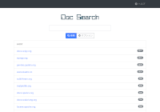

===================================
Open Source Volltextsuchserver Fess
===================================

Überblick
=========

Fess ist ein **"in 5 Minuten einfach zu erstellender Volltextsuchserver"**.

.. figure:: ../resources/images/en/demo-1.png
   :scale: 100%
   :alt: Standard-Demo
   :figclass: side-by-side
   :target: https://search.n2sm.co.jp/

   Standard-Demo

.. figure:: ../resources/images/en/demo-3.png
   :scale: 100%
   :alt: Site-Suche Demo
   :figclass: side-by-side
   :target: https://www.n2sm.net/search.html?q=Fess

   Site-Suche Demo

.. figure:: ../resources/images/en/demo-2.png
   :scale: 100%
   :alt: Code Search
   :figclass: side-by-side
   :target: https://codesearch.codelibs.org/

   Quellcode-Suche

   Dokumentensuche

Fess kann auf jedem Betriebssystem ausgeführt werden, auf dem Java oder Docker verfügbar ist.
Fess wird unter der Apache-Lizenz bereitgestellt und ist kostenlos (Freeware) nutzbar.

Download
========

- :doc:`Fess 15.4.0 <downloads>` (zip/rpm/deb-Pakete)

Funktionen
==========

-  Bereitstellung unter Apache-Lizenz (kostenlose Nutzung als Freeware)

-  Crawling von Web, Dateisystemen, Windows-Freigabeordnern und Datenbanken

-  Unterstützung vieler Dateiformate wie MS Office (Word/Excel/PowerPoint) und PDF

-  Betriebssystemunabhängig (Java-basiert)

-  Bereitstellung von JavaScript zur Integration in bestehende Websites

-  Verwendung von OpenSearch oder Elasticsearch als Suchmaschine

-  Durchsuchbar auch für Sites mit BASIC/DIGEST/NTLM/FORM-Authentifizierung

-  Unterschiedliche Suchergebnisse je nach Anmeldestatus möglich

-  Single Sign-On (SSO) mit Active Directory, SAML usw.

-  Standortbasierte Suche in Verbindung mit Karteninformationen

-  Konfiguration von Crawl-Zielen und Bearbeitung der Suchoberfläche im Browser möglich

-  Klassifizierung von Suchergebnissen durch Labeling

-  Hinzufügen von Informationen zu Anfrage-Headern, Konfiguration doppelter Domains, Pfadkonvertierung von Suchergebnissen

-  Integration mit externen Systemen durch Ausgabe von Suchergebnissen im JSON-Format

-  Aggregation von Suchprotokollen und Klickprotokollen

-  Unterstützung von Facetten und Drill-Down

-  Autovervollständigungs- und Vorschlagsfunktionen

-  Bearbeitungsfunktion für Benutzerwörterbücher und Synonymwörterbücher

-  Cache-Anzeigefunktion und Miniaturbildanzeigefunktion für Suchergebnisse

-  Proxy-Funktion für Suchergebnisse

-  Unterstützung für Smartphones (Responsive Web Design)

-  Integration externer Systeme durch Zugangstoken

-  Unterstützung für externe Textextraktion wie OCR

-  Flexibles Design je nach Verwendungszweck

Nachrichten
===========

2025-12-25
    `Fess 15.4.0 Release <https://github.com/codelibs/fess/releases/tag/fess-15.4.0>`__

2025-10-25
    `Fess 15.3.0 Release <https://github.com/codelibs/fess/releases/tag/fess-15.3.0>`__

2025-09-04
    `Fess 15.2.0 Release <https://github.com/codelibs/fess/releases/tag/fess-15.2.0>`__

2025-07-20
    `Fess 15.1.0 Release <https://github.com/codelibs/fess/releases/tag/fess-15.1.0>`__

2025-06-22
    `Fess 15.0.0 Release <https://github.com/codelibs/fess/releases/tag/fess-15.0.0>`__

Für ältere Nachrichten siehe :doc:`hier <news>`.

Forum
=====

Wenn Sie Fragen haben, nutzen Sie bitte das `Forum <https://discuss.codelibs.org/c/FessJA/>`__.

Kommerzieller Support
=====================

Fess ist ein Open-Source-Produkt unter der Apache-Lizenz und kann sowohl privat als auch kommerziell kostenlos genutzt werden.

Wenn Sie Unterstützungsdienste für die Anpassung, Einführung oder den Aufbau von Fess benötigen, siehe `kommerzieller Support (kostenpflichtig) <https://www.n2sm.net/products/n2search.html>`__.
Darüber hinaus werden auch Performance-Tuning-Maßnahmen wie die Verbesserung der Suchqualität und Crawl-Geschwindigkeit im kommerziellen Support angeboten.

- `N2 Search <https://www.n2sm.net/products/n2search.html>`__ (optimiertes kommerzielles Fess-Paket)

- `N2 Search Super Lite <https://www.n2sm.net/services/n2search-asp-lite.html>`__ (Alternative zum Google Site Search Service)

- :doc:`Verschiedene Support-Services <support-services>`

Fess Site Search
================

Das CodeLibs-Projekt bietet `Fess Site Search (FSS) <https://fss-generator.codelibs.org/ja/>`__ an.
Durch einfaches Platzieren von JavaScript auf bestehenden Websites können Sie die Fess-Suchseite integrieren.
Mit FSS ist auch die Migration von Google Site Search oder Yahoo! Custom Search einfach möglich.
Wenn Sie einen kostengünstigen Fess-Server benötigen, siehe `N2 Search Super Lite <https://www.n2sm.net/services/n2search-asp-lite.html>`__.

Data Store Plugins
==================

- `Confluence/Jira <https://github.com/codelibs/fess-ds-atlassian>`__
- `Box <https://github.com/codelibs/fess-ds-box>`__
- `CSV <https://github.com/codelibs/fess-ds-csv>`__
- `Database <https://github.com/codelibs/fess-ds-db>`__
- `Dropbox <https://github.com/codelibs/fess-ds-dropbox>`__
- `Elasticsearch <https://github.com/codelibs/fess-ds-elasticsearch>`__
- `Git <https://github.com/codelibs/fess-ds-git>`__
- `Gitbucket <https://github.com/codelibs/fess-ds-gitbucket>`__
- `G Suite <https://github.com/codelibs/fess-ds-gsuite>`__
- `JSON <https://github.com/codelibs/fess-ds-json>`__
- `Office 365 <https://github.com/codelibs/fess-ds-office365>`__
- `S3 <https://github.com/codelibs/fess-ds-s3>`__
- `Salesforce <https://github.com/codelibs/fess-ds-salesforce>`__
- `SharePoint <https://github.com/codelibs/fess-ds-sharepoint>`__
- `Slack <https://github.com/codelibs/fess-ds-slack>`__

Theme Plugins
=============

- `Simple <https://github.com/codelibs/fess-theme-simple>`__
- `Classic <https://github.com/codelibs/fess-theme-classic>`__

Ingester Plugins
================

- `Logger <https://github.com/codelibs/fess-ingest-logger>`__
- `NDJSON <https://github.com/codelibs/fess-ingest-ndjson>`__

Script Plugins
==============

- `Groovy <https://github.com/codelibs/fess-script-groovy>`__
- `OGNL <https://github.com/codelibs/fess-script-ognl>`__

Verwandte Projekte
==================

- `Code Search <https://github.com/codelibs/docker-codesearch>`__
- `Document Search <https://github.com/codelibs/docker-docsearch>`__
- `Fione <https://github.com/codelibs/docker-fione>`__
- `Form Assist <https://github.com/codelibs/docker-formassist>`__

.. |image0| image:: ../resources/images/en/demo-1.png
.. |image1| image:: ../resources/images/en/demo-2.png
.. |image2| image:: ../resources/images/en/demo-3.png
.. |image3| image:: ../resources/images/en/n2search_225x50.png
   :target: https://www.n2sm.net/products/n2search.html
.. |image4| image:: ../resources/images/en/n2search_b.png

.. toctree::
   :hidden:

   overview
   basic
   documentation
   tutorial
   development
   others
   archives

