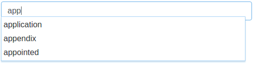
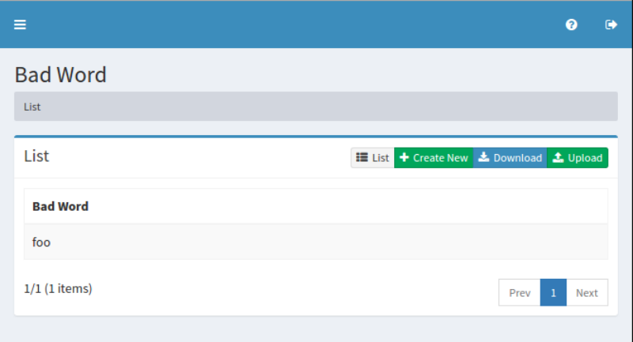
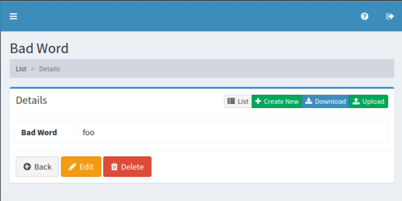
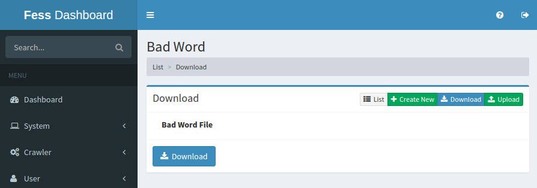
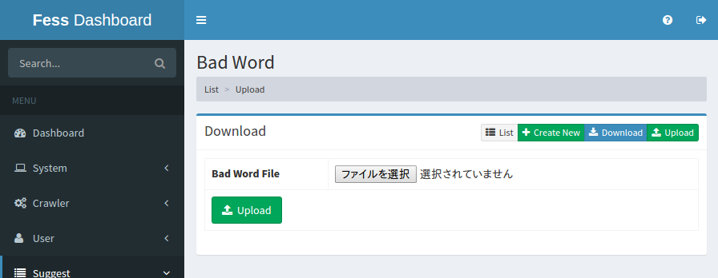

========
Bad Word
========

Overview
========

Bad Word Configuration page manages words to exclude them from suggest feature.

Management Operations
=====================

Display Configurations
----------------------

Select Crawler > Bad Word in the left menu to display a list page of Bad Word Configuration, as below.

|image0|

Click a configuration name if you want to edit it.

Create Configuration
--------------------

Click Create New button to display a form page for Bad Word configuration.

|image1|

Configurations
--------------

Bad Word
::::::::

Word to exclude it from Suggest.

Delete Configuration
--------------------

Click a configuration on a list page, and click Delete button to display a aconfirmation dialog.
Click Delete button to delete the configuration.

Download
========

You can download a word list file as CSV file.

|image3|

Upload
======

You can upload CSV file containing a word list to exclude from Suggest.

|image4|

CSV File
--------

The content of downloaded/uploaded CSV file is 1 column, and contains only a word.

