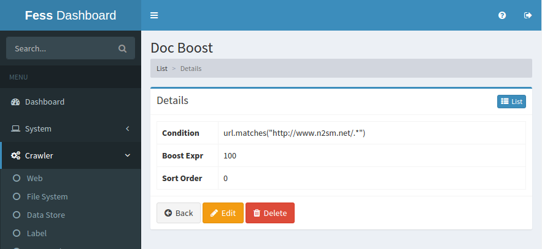

=========
Doc Boost
=========

Overview
========

TBD

Management Operations
=====================

Display Configurations
----------------------

Select Crawler > Doc Boost in the left menu to display a list page of Doc Boost Configuration, as below.

|image0|

Click a configuration name if you want to edit it.

Create Configuration
--------------------

Click Create New button to display a form page for Doc Boost configuration.

|image1|

Configurations
--------------

Condition
:::::::::

TBD

Boost Expr
::::::::::

TBD

Sort Order
::::::::::

TBD

Delete Configuration
--------------------

Click a configuration on a list page, and click Delete button to display a aconfirmation dialog.
Click Delete button to delete the configuration.

Example
=======

TBD
--------------------------

TBD

.. |image0| image:: ../../../resources/images/en/10.0/admin/documentBoost-1.png

