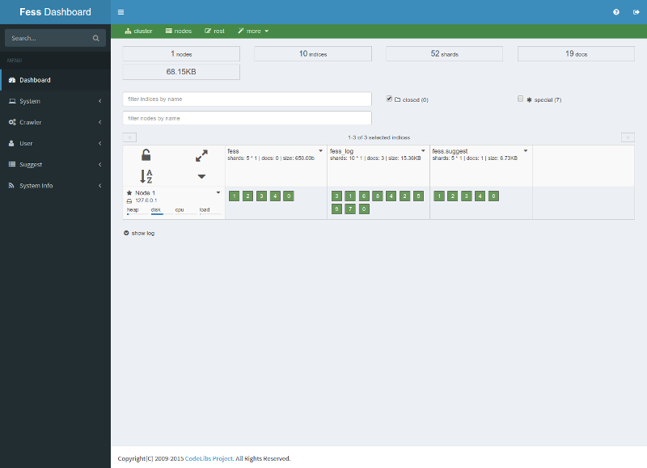
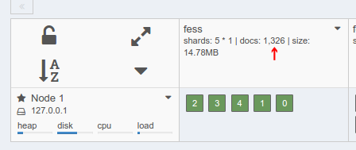

==========================
Dashboard
==========================

Overview
========

Dashboard provides a web administration tool for elasticsearch to manage cluster and indices.

|image0|

|Fess| manages the following indices:

* fess: indexed documents
* fess_log: access logs
* fess.suggest: suggest words
* .fess_config: configurations
* .fess_user: user/role/group data
* .configsync: dictionaries data
* .suggest: suggest meta data
* .suggest-array: suggest meta data
* .suggest-badword: excluding word list for suggest

Check The Number Of Indexed Documents
=====================================

The number of indexed documents is displayed in fess index as the following figure.

|image1|

