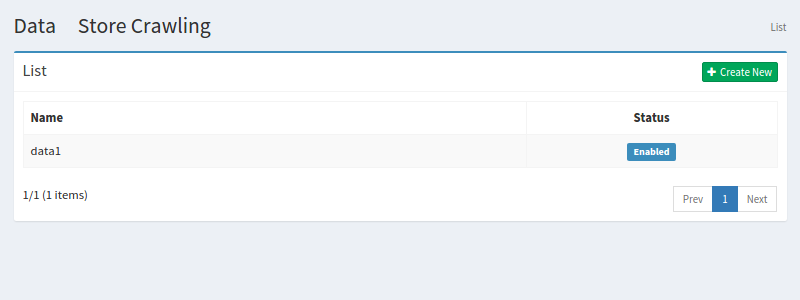
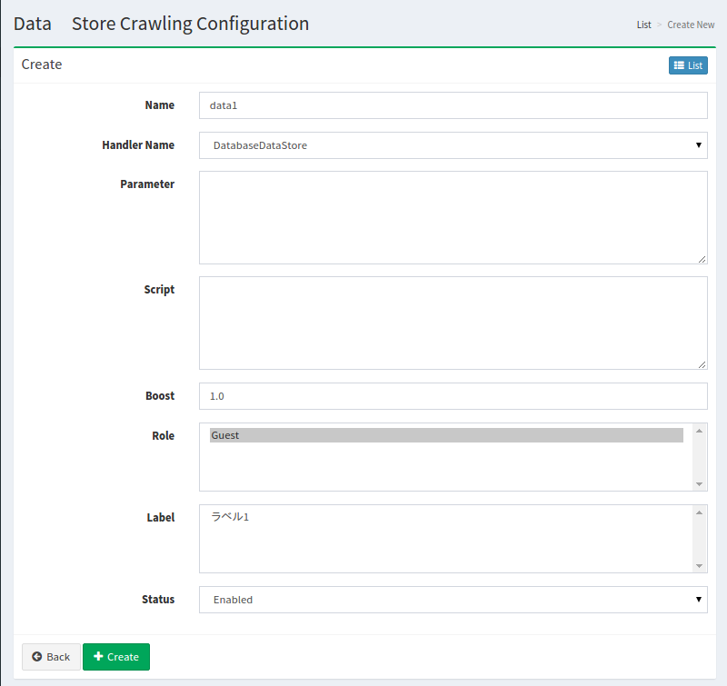

==========
Data Store
==========

Overview
========

Data Store Crawling Configuaration page manages configurations for crawling on Data Strore, such as Database.

Management Operations
=====================

Display Configurations
----------------------

Select Crawler > Data Store in the left menu to display a list page of Data Store Configuration, as below.

|image0|

Click a configuration name if you want to edit it.

Create Configuration
--------------------

Click Create New button to display a form page for Data Store configuration.

|image1|

Configurations
--------------

Name
::::

Configuration name.

Handler Name
::::::::::::

Type of Data Strore.

Parameter
:::::::::

Parameters for Data Strore crawling.

Script
::::::

Field mapping on index.
The format is key/value, such as [Field Name In Index]=[Value(Groovy Supported].

Boost
:::::

Boost value is a weight for indexed documents of this configuration.

Role
::::

Roles for this configuration.

Delete Configuration
--------------------

Click a configuration on a list page, and click Delete button to display a confirmation dialog.
Click Delete button to delete the configuration.

