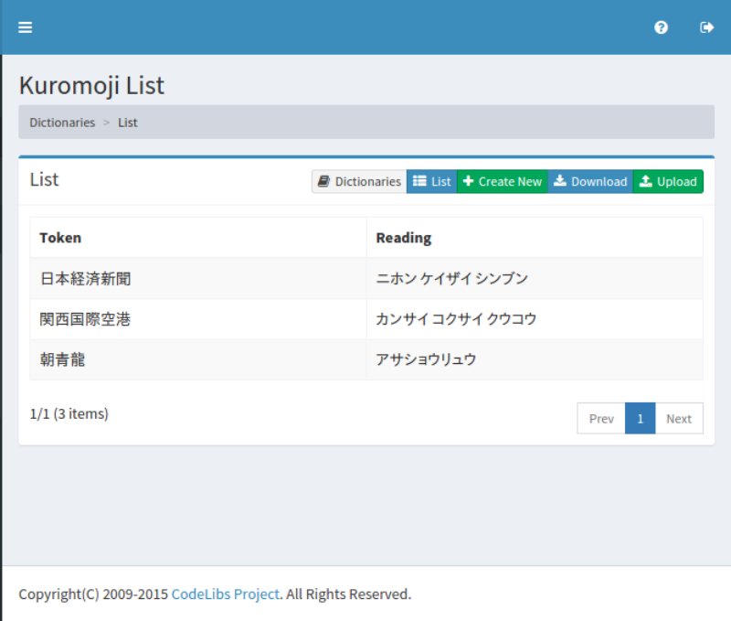
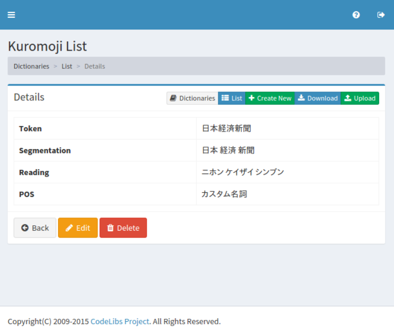
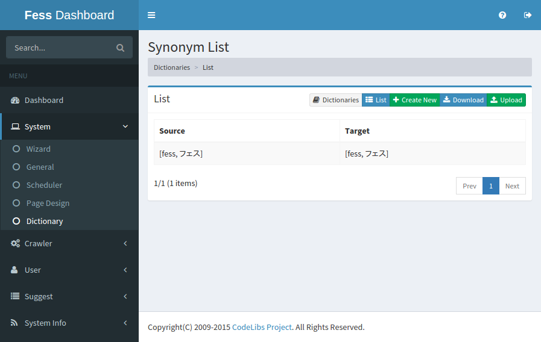
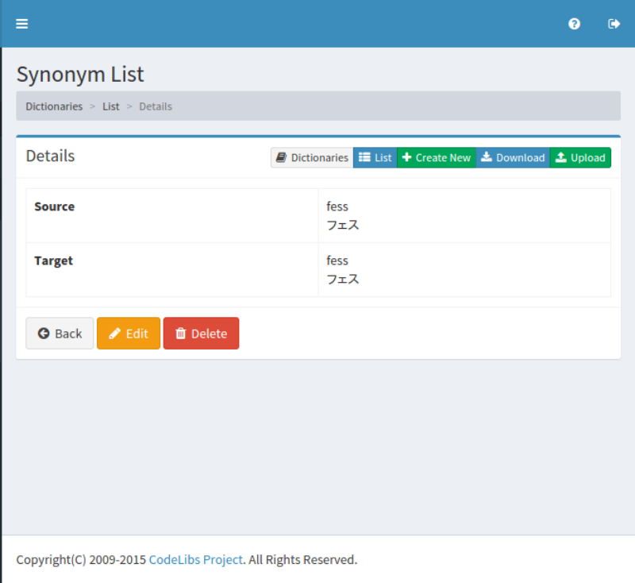

==========================
Dictionary
==========================

Overview
========

TBD

Setup
=============

TBD
--------------

TBD

|image0|

User dictionary
============

|image1|

TBD

|image2|

Token
-----

TBD

Split
-----

TBD

Read
----

Parts of speech
---------------

Synonym dictionary
============

TBD

|image3|

TBD

|image4|

Source
------

TBD

After the conversion
--------------------

TBD

.. |image0| image:: ../../../resources/images/en/10.0/admin/dict-1.png

