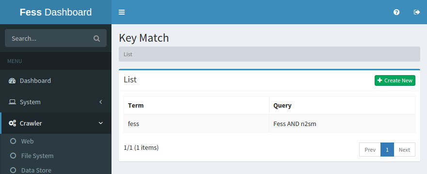
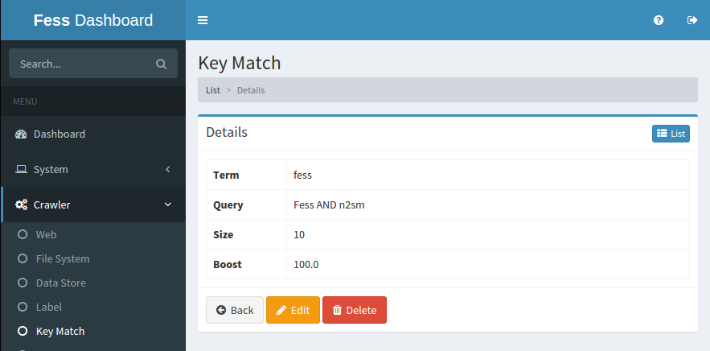

=========
Key Match
=========

Overview
========

TBD

Management Operations
=====================

Display Configurations
----------------------

Select Crawler > Key Match in the left menu to display a list page of Key Match Configuration, as below.

|image0|

Click a configuration name if you want to edit it.

Create Configuration
--------------------

Click Create New button to display a form page for Key Match configuration.

|image1|

Configurations
--------------

Term
::::

TBD

Query
:::::

TBD

Size
::::

TBD

Boost
:::::

TBD

Delete Configuration
--------------------

Click a configuration on a list page, and click Delete button to display a aconfirmation dialog.
Click Delete button to delete the configuration.

Example
=======

TBD
--------------------------

TBD

