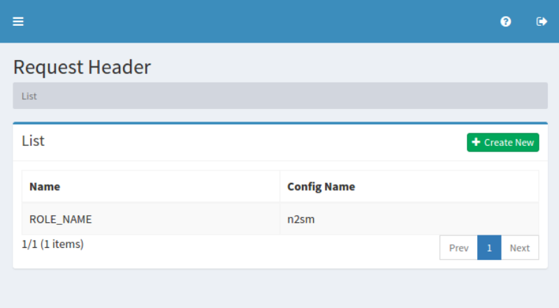
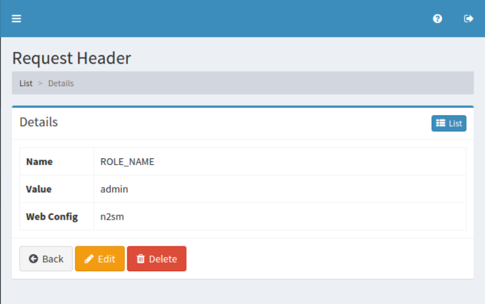

==============
Request Header
==============

Overview
========

TBD

Management Operations
=====================

Display Configurations
----------------------

Select Crawler > Request Header in the left menu to display a list page of Request Header Configuration, as below.

|image0|

Click a configuration name if you want to edit it.

Create Configuration
--------------------

Click Create New button to display a form page for Request Header configuration.

|image1|

Configurations
--------------

Name
::::

TBD

Value
:::::

TBD

Web Config
::::::::::

TBD

Delete Configuration
--------------------

Click a configuration on a list page, and click Delete button to display a confirmation dialog.
Click Delete button to delete the configuration.

