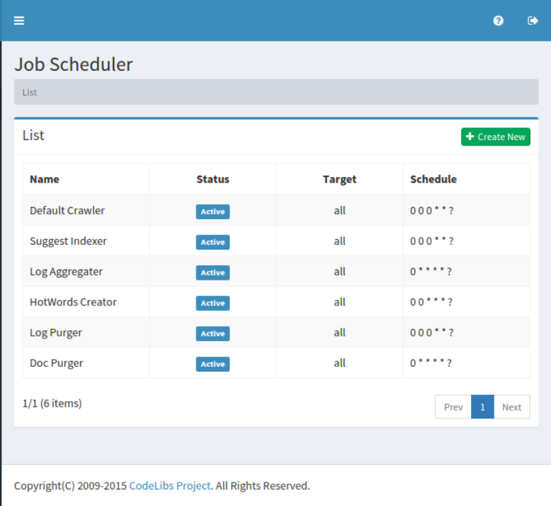
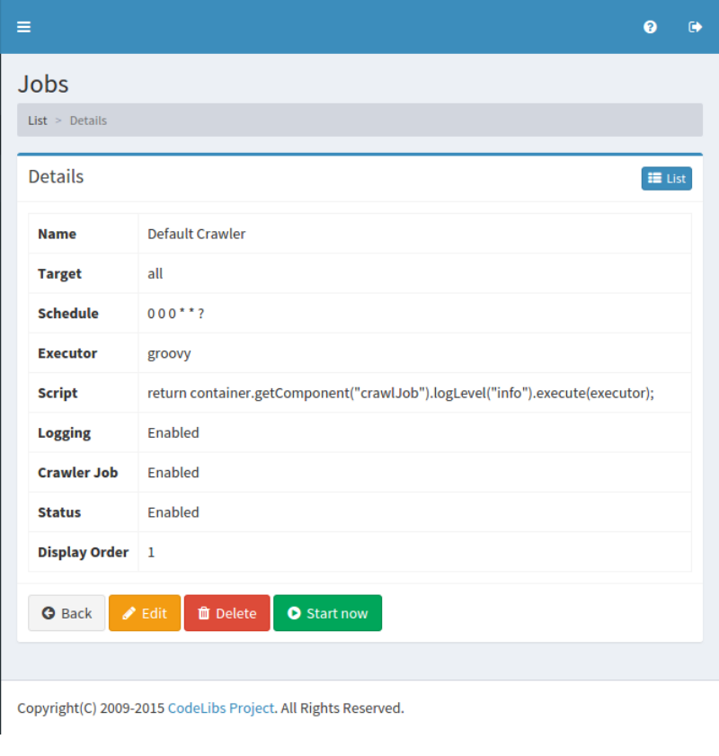

=========
Scheduler
=========

Overview
========

TBD

Management Operations
=====================

Display Configurations
----------------------

Select System > Scheduler in the left menu to display a list page of Job Scheduler Configuration, as below.

|image0|

Click a configuration name if you want to edit it.

Create Configuration
--------------------

Click Create New button to display a form page for Job Scheduler configuration.

|image1|

Configurations
--------------

Name
::::

TBD

Target
::::::::::::::::

TBD

Schedule
::::::::

TBD

Executor
::::::::

TBD

Script
::::::

TBD

Logging
:::::::

TBD

Crawler Job
:::::::::::

TBD

Status
::::::

TBD

Display Order
:::::::::::::

TBD

Delete Configuration
--------------------

Click a configuration on a list page, and click Delete button to display a confirmation dialog.
Click Delete button to delete the configuration.

