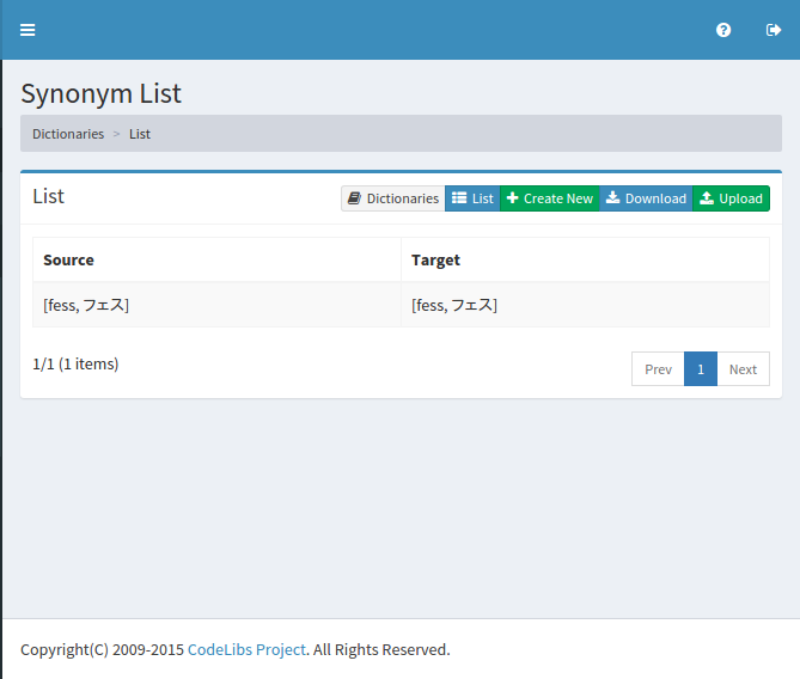
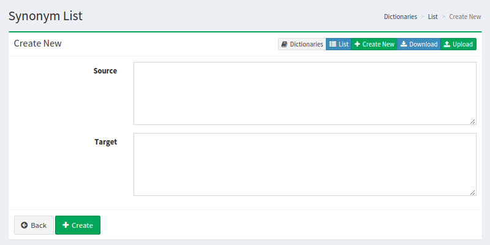

============
Synonym List
============

Overview
========

TBD

Management Operations
=====================

Display Configurations
----------------------

Select System > Dictionaly in the left menu and click synonym to display a list page of Synonym Configuration, as below.

|image0|

Click a configuration name if you want to edit it.

Create Configuration
--------------------

Click Create New button to display a form page for synonym configuration.

|image1|

Configurations
--------------

Source
::::::

TBD

Target
::::::

TBD

