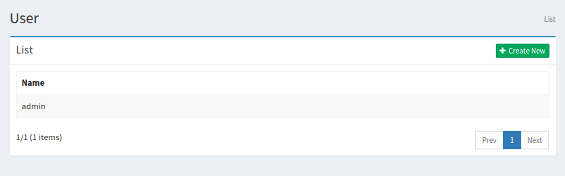
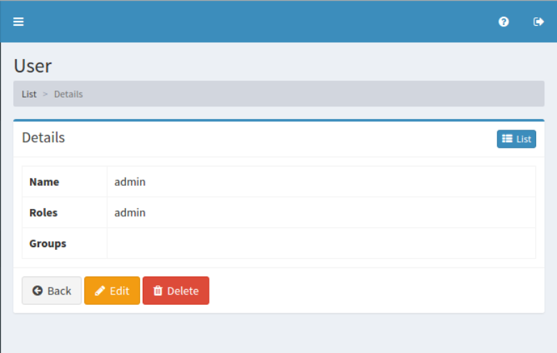

====
User
====

Overview
========

TBD

Management Operations
=====================

Display Configurations
----------------------

Select User > User in the left menu to display a list page of User Configuration, as below.

|image0|

Click a configuration name if you want to edit it.

Create Configuration
--------------------

Click Create New button to display a form page for User configuration.

|image1|

Configurations
--------------

Name
::::

TBD

Roles
:::::

TBD

Groups
::::::

TBD

Delete Configuration
--------------------

Click a configuration on a list page, and click Delete button to display a aconfirmation dialog.
Click Delete button to delete the configuration.

