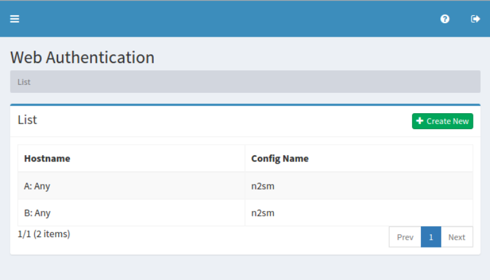
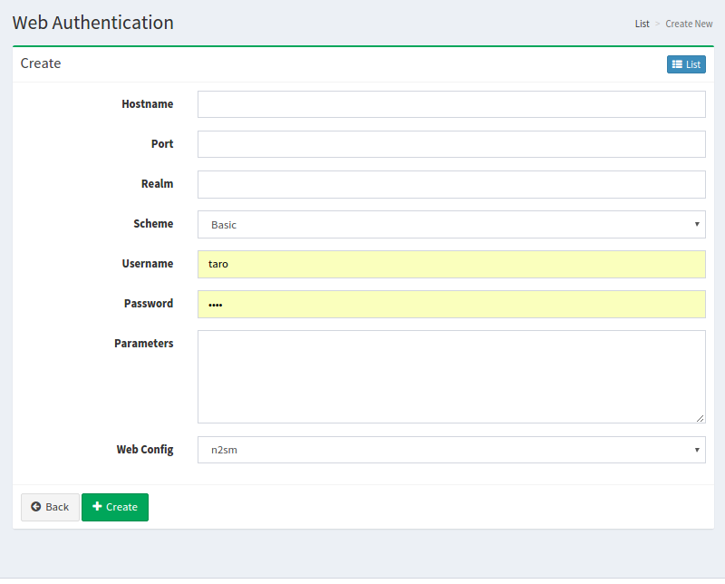

==================
Web Authentication
==================

Overview
========

TBD

Management Operations
=====================

Display Configurations
----------------------

Select Crawler > Web Authentication in the left menu to display a list page of Web Authentication Configuration, as below.

|image0|

Click a configuration name if you want to edit it.

Create Configuration
--------------------

Click Create New button to display a form page for Web Authentication configuration.

|image1|

Configurations
--------------

Hostname
::::::::

TBD

Port
::::

TBD

Realm
:::::

TBD

Scheme
::::::

TBD

Username
::::::::

TBD

Password
::::::::

TBD

Parameters
::::::::::

TBD

Web Config
::::::::::

TBD

Delete Configuration
--------------------

Click a configuration on a list page, and click Delete button to display a aconfirmation dialog.
Click Delete button to delete the configuration.

Example
=======

TBD
--------------------------

TBD

