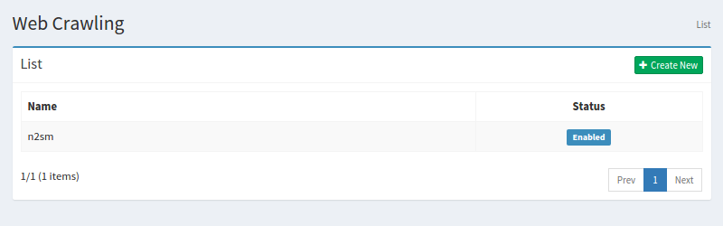
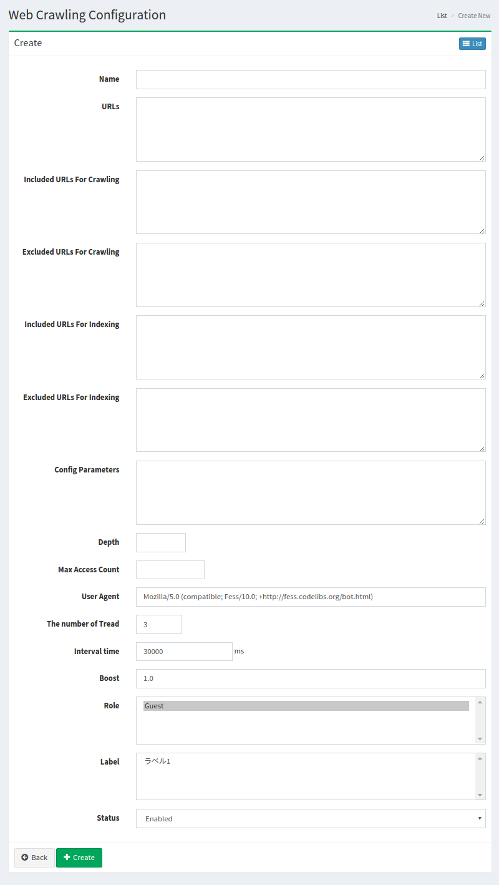

==========================
Web Crawling Configuration
==========================

Overview
========

Web Crawling Configuaration page manages configurations for Web crawling.

Management Operations
=====================

Display Configurations
----------------------

Select Crawler > Web in the left menu to display a list page of Web Crawling Configuration, as below.

|image0|

Click a configuration name if you want to edit it.

Create Configuration
--------------------

Click Create New button to display a form page for Web crawling configuration.

|image1|

Configurations
--------------

Name
::::
Configuration name.

URLs
::::
This URLs are locations to start crawling.

Included URLs For Crawling
::::::::::::::::::::::::::

This regular expression(Java Format) is allowed url patterns for |Fess| crawler.

Excluded URLs For Crawling
::::::::::::::::::::::::::

This regular expression(Java Format) is rejected url patterns for |Fess| crawler.

Included URLs For Indexing
::::::::::::::::::::::::::

This regular expression(Java Format) is allowed url patterns for |Fess| indexer.

Excluded URLs For Indexing
::::::::::::::::::::::::::

This regular expression(Java Format) is rejected url patterns for |Fess| indexer.

Depth
:::::

The number of linked urls.

Max Access Count
::::::::::::::::

The number of indexed urls.

User Agent
::::::::::

Name of |Fess| crawler.

The number of Thread
:::::::::::::::::::

The number of crawler threads for this configuration.

Interval time
:::::::::::::

Interval time to crawl urls for each thread.

Boost
:::::

Boost value is a weight for indexed documents of this configuration.

Role
::::

Roles for this configuration.

Label
:::::

Labels for this configuration.

Status
::::::

If enabled, the scheduled job of Default Crawler includes this configuration.

Delete Configuration
--------------------

Click a configuration on a list page, and click Delete button to display a aconfirmation dialog.
Click Delete button to delete the configuration.

Example
=======

Crawling Fess Site
------------------

If you want to create Web crawling configuration to crawl pages under http://fess.codelibs.org/, parameters are:

+----------------------------+-----------------------------+
| Name                       | Value                       |
+============================+=============================+
| Name                       | Fess                        |
+----------------------------+-----------------------------+
| URLs                       | http://fess.codelibs.org/   |
+----------------------------+-----------------------------+
| Included URLs For Crawling | http://fess.codelibs.org/.* |
+----------------------------+-----------------------------+

For other parameters, use a default value.

