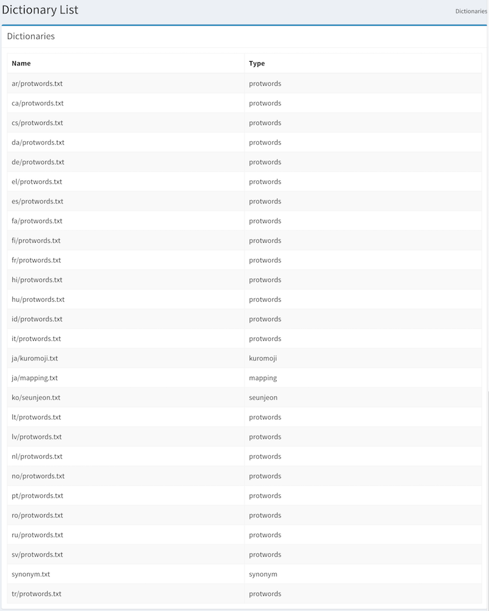

==========
Dictionary
==========

Overview
========

Dictionary page contains the following dictionary management:

- Synonym dictionary
- Kuromoji (Japanese language morphological analysis) dictionary

Management Operations
=============

Display Dictionary page
--------------

Select System > Dictionary in the left menu to display a list page, as below, and then click a dictionary name to edit words.

|image0|

