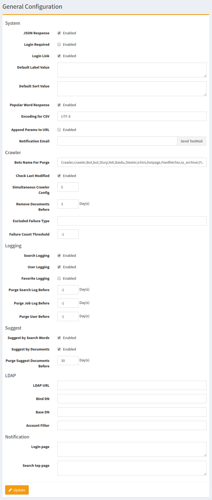

=====================
General Configuration
=====================

Overview
========

This administrative page manages configurations for |Fess|.
You can change |Fess|'s behavior without rebooting the |Fess|.

Management Operations
========

Display Configurations
----------------------

Select System > General in the left menu to display General Configuration page, as below.

|image0|

System
--------

JSON Response
:::::::::::::

Enable JSON response of Search features.

Login Required
::::::::::::::

Search pages are not displayed on Guest user if enabled.

Login Link
::::::::::

Login menu is displayed at the top of search pages if enabled.

Default Label Value
:::::::::::::::::::

Specify default labels on search pages.

Default Sort Value
::::::::::::::

Specify default sort order on search pages.

Popular Word Response
::::::::::::::

TBD

Encoding for CSV
::::::::::::::

TBD

Append Params to URL
::::::::::::::

TBD

Notification Email
::::::::::::::

TBD

Crawler
--------

Bots Name For Purge
::::::::::::::

TBD

Check Last Modified
::::::::::::::

TBD

Simultaneous Crawler Config
::::::::::::::

TBD

Remove Documents Before
::::::::::::::

TBD

Excluded Failure Type
::::::::::::::

TBD

Failure Count Threshold
::::::::::::::

TBD

Logging
--------

Search Logging
::::::::::::::

TBD

User Logging
::::::::::::::

TBD

Favorite Logging
::::::::::::::

TBD

Purge Search Log Before
::::::::::::::

TBD

Purge Job Log Before
::::::::::::::

TBD

Purge User Before
::::::::::::::

TBD

Suggest
--------
Suggest by Search Words
::::::::::::::

TBD

Suggest by Documents
::::::::::::::

TBD

Purge Suggest Documents Before
::::::::::::::

TBD

LDAP
--------

LDAP URL
::::::::::::::

TBD

Bind DN
::::::::::::::

TBD

Base DN
::::::::::::::

TBD

Account Filter
::::::::::::::

TBD

Notification
--------

Login page
::::::::::::::

TBD

Search top page
::::::::::::::

TBD

