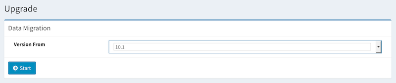

=======
Upgrade
=======

Overview
====

Upgrade page provides data migration tools for previous versions of |Fess|.

|image0|

Operations
========

Migration
--------

Type /admin/upgrade/ to URL after logging in as admin user.
Select a target version and then click button to execute data mingration process.

Configurations
--------

Target Version
::::

|Fess| version from which you want to upgrade.

