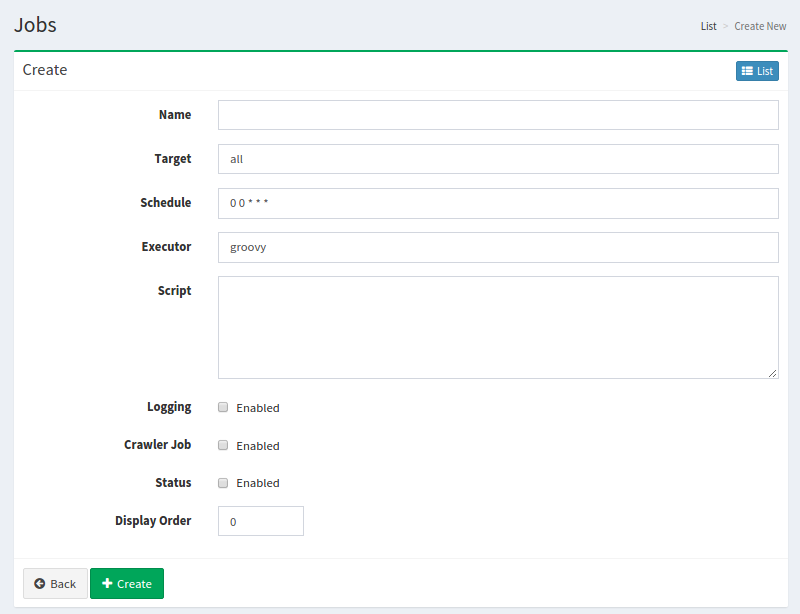

=========
Scheduler
=========

Overview
========

|Fess| provides Job Scheduler to manage jobs.
Scheduler page manages them.

Management Operations
=====================

Display Configurations
----------------------

Select System > Scheduler in the left menu to display a list page of Job Scheduler Configuration, as below.

|image0|

Click a job name if you want to edit it.

Create Configuration
--------------------

Click Create New button to display a form page for Job Scheduler configuration.

|image1|

Configurations
--------------

Name
::::

Job name.

Target
::::::::::::::::

Target name on which this job runs.

Schedule
::::::::

Schedule to run this job. This value is cron-format.

Executor
::::::::

Execution environment. 
Only "groovy" is supported at the moment.

Script
::::::

Scripts for job.

Logging
:::::::

Whether this job prints to a job result.

Crawler Job
:::::::::::

Whether this job is for crawler.

Status
::::::

Whether this job is available or not.

Display Order
:::::::::::::

Display order.

Delete Configuration
--------------------

Click a job name on a list page, and click Delete button to display a confirmation dialog.
Click Delete button to delete the configuration.

.. |image0| image:: ../../../resources/images/en/12.5/admin/scheduler-1.png

