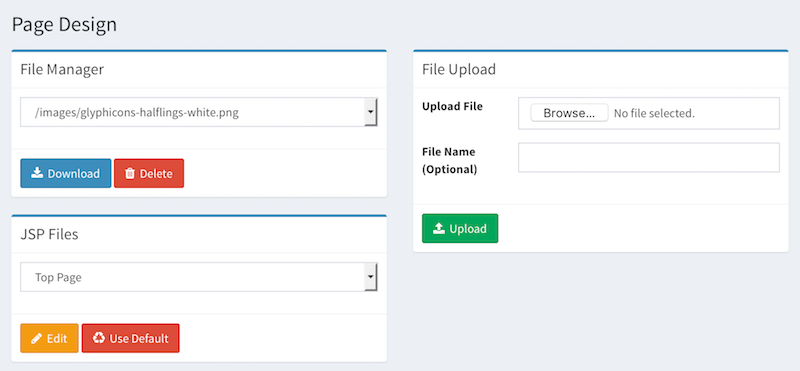

===========
Page Design
===========

Overview
========

Page Design page manages search pages and resource files, such as images and css files.

Page Design Menu
----------------

Page Design contains the following features:

- File Manager
- File Upload
- Edit JSP page

|image0|

Edit JSP Page
----------

Select a page name and click Edit button.
If you want to restore an original page, click Use Default button.

|image1|

After editing the content, click Update button to save the page file.

.. |image1| image:: ../../../resources/images/en/12.7/admin/design-2.png
