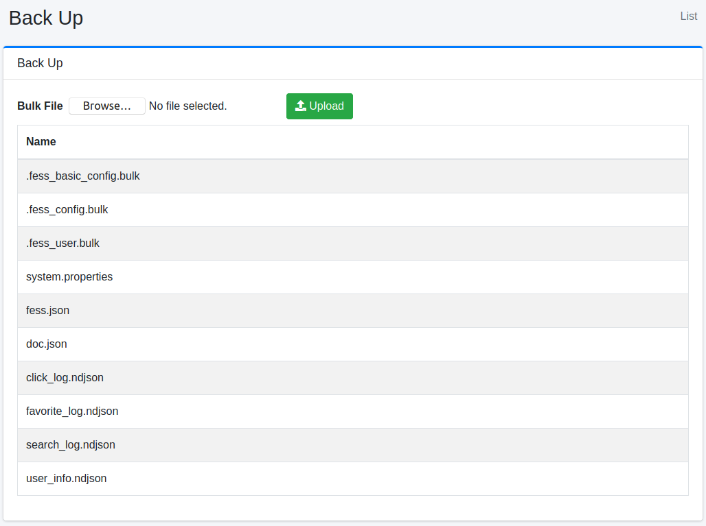

======
Backup
======

Overview
========

Backup page allows you to download and upload your configuration data for |Fess|.

Management Operations
=====================

Download Data
--------------

|Fess| manages configuration data as indices.
To download your configuration, click the index name.

|image0|

.fess_config
::::::::::::

.fess_config index contains |Fess| configuration data.

.fess_basic_config
::::::::::::

.fess_basic_config index contains |Fess| configuration data without failure urls.

.fess_user
::::::::::

.fess_user index contains user, role and group information.

system.properties
:::::::::::::::::

System configuration file.

click_log.ndjson
:::::::::::::

Click log file.

favorite_log.ndjson
::::::::::::::::

Favorite log file.

search_log.ndjson
::::::::::::::

Search log file.

user_info.ndjson
:::::::::::::

Accessed user log file.

upload
--------------

Configuration data can be imported by uploading a file.
Files that can be restored are \*.bulk and system.properties.

