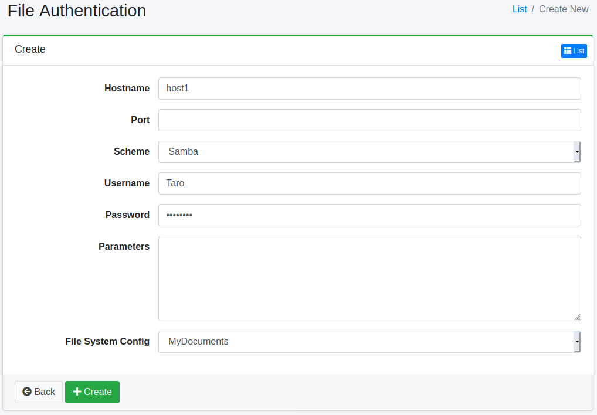

===================
File Authentication
===================

Overview
========

File Authentication page manages settings for authentication on file crawling.

Management Operations
=====================

Display Configurations
----------------------

Select Crawler > File Authentication in the left menu to display a list page of File Authentication Configuration, as below.

|image0|

Click a configuration name if you want to edit it.

Create Configuration
--------------------

Click Create New button to display a form page for File Authentication configuration.

|image1|

Configurations
--------------

Host name
:::::::::

Target host name for file crawling.

Port
::::

Port of the above host.

Scheme
::::::

Protocol scheme.

Username
::::::::

Username for authentication.

Password
::::::::

Password for authentication.

Parameters
::::::::::

Additional parameters.

FS Config
:::::::::

File Crawling for this setting.

Delete Configuration
--------------------

Click a configuration on a list page, and click Delete button to display a confirmation dialog.
Click Delete button to delete the configuration.

.. |image0| image:: ../../../resources/images/en/13.13/admin/fileauth-1.png

