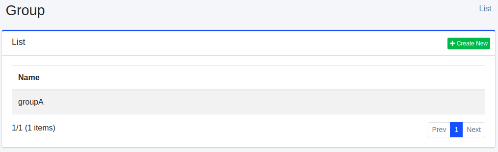
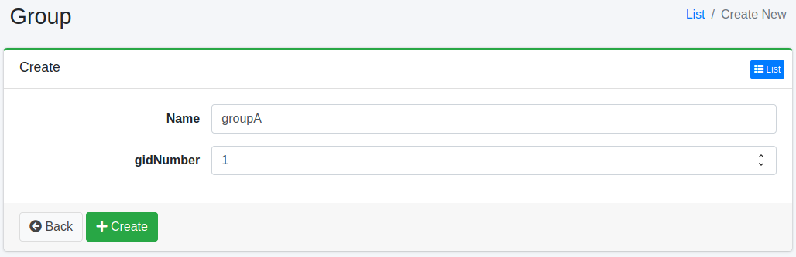

=====
Group
=====

Overview
========

Group Configuration page manages groups of user management.

Management Operations
=====================

Display Configurations
----------------------

Select User > Group in the left menu to display a list page of Group Configuration, as below.

|image0|

Click a group name if you want to edit it.

Create Configuration
--------------------

Click Create New button to display a form page for Group configuration.

|image1|

Configurations
--------------

Name
::::

Group name.

Delete Configuration
--------------------

Click a group name on a list page, and click Delete button to display a confirmation dialog.
Click Delete button to delete the configuration.

