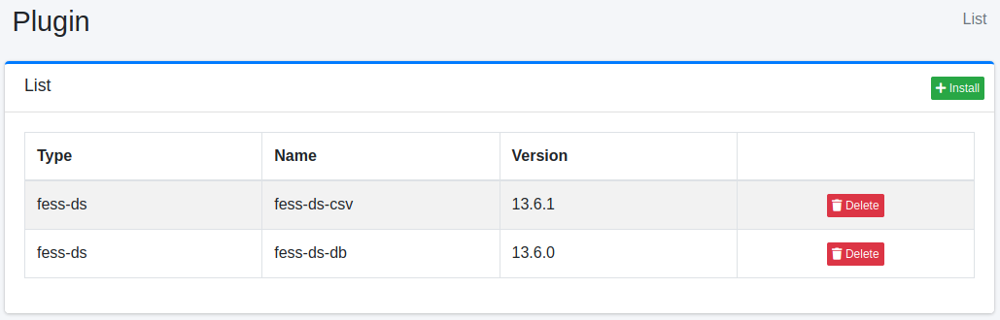

================
Plugin
================

Overview
====

Plugin page manages plugins.

Management Operations
========

Display Installed Plugins
--------

Select System > Plugin in the left menu to display a list page of installed plugins, as below.

|image0|

Click Delete button if you want to uninstall it.

Install New Plugins
--------

Click Install button on the list page if you want to install new plugins.

|image1|

Select the plugin you want to install on the dropdown list, and click Install button to install it.

.. |image1| image:: ../../../resources/images/en/13.16/admin/plugin-2.png