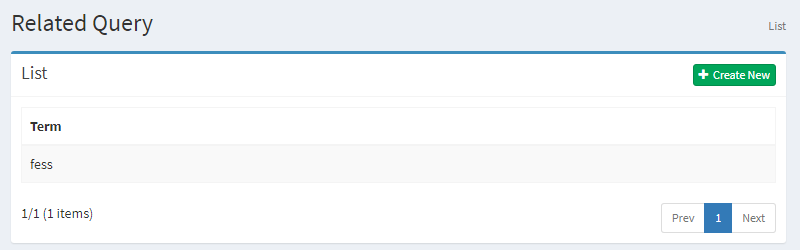
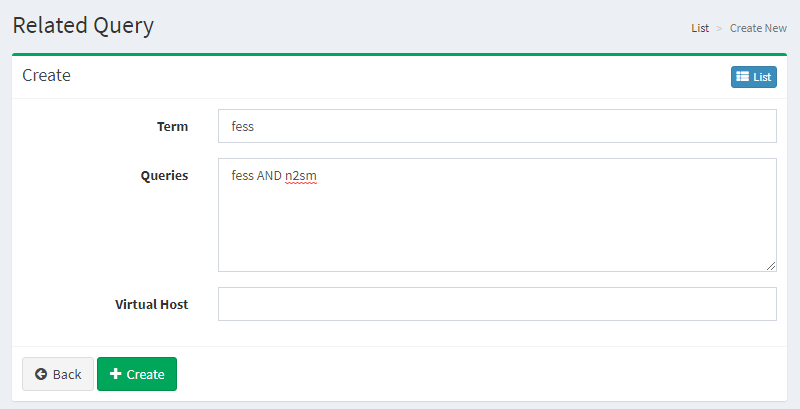

=============
Related Query
=============

Overview
========

Related Query Configuration page manages related query settings.
This feature helps users refine their searches by registering related queries.
Related query is a suggestion for an alternative word for the user's original search term.

Management Operations
=====================

Display Configurations
----------------------

Select Crawler > Related Query in the left menu to display a list page of Related Query Configuration, as below.

|image0|

Click a configuration name if you want to edit it.

Create Configuration
--------------------

Click Create New button to display a form page for Related Query configuration.

|image1|

Configurations
--------------

Term
::::

Term to match a search query.

Queries
:::::::

Additional search query.

Virtual Host
::::::::::::

Virtual Host key for this configuration.
e.g. fess (if setting Host:fess.codelibs.org=fess in General)

Delete Configuration
--------------------

Click a configuration on a list page, and click Delete button to display a confirmation dialog.
Click Delete button to delete the configuration.

