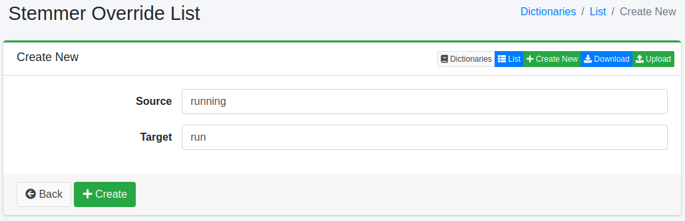

============
Stemmer Override List
============

Overview
========

TBD
Stemmer Override page manages dictionary of stemmer override characters.
The stemmer override dictionary maps characters to other one.

Management Operations
=====================

Display Configurations
----------------------

Select System > Dictionary in the left menu and click stemmer override file to display a list page of Stemmer Override Configuration, as below.

|image0|

Click a word name if you want to edit it.

Create Configuration
--------------------

Click Create New button to display a form page for stemmer override configuration.

|image1|

Configurations
--------------

Source
::::::

Replaced characters.

Target
::::::

Used character.

.. |image0| image:: ../../../resources/images/en/13.6/admin/stemmeroverride-1.png

