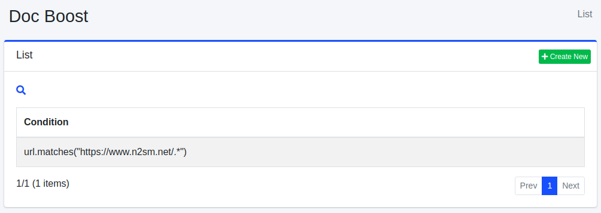

=========
Doc Boost
=========

Overview
========

Doc Boost Configuration page manages document boost settings.
This feature sets boosting score for each documents at indexing time and boosts the specific documents in a search result.

Management Operations
=====================

Display Configurations
----------------------

Select Crawler > Doc Boost in the left menu to display a list page of Doc Boost Configuration, as below.

|image0|

Click a configuration name if you want to edit it.

Create Configuration
--------------------

Click Create New button to display a form page for Doc Boost configuration.

|image1|

Configurations
--------------

Condition
:::::::::

Condition to boost a document. 
This value is written by Groovy.

Boost Expr
::::::::::

Boosting score if document matches the condition. 
This value is written by Groovy.

Sort Order
::::::::::

Order to display/process doc boosts.

Delete Configuration
--------------------

Click a configuration on a list page, and click Delete button to display a confirmation dialog.
Click Delete button to delete the configuration.

