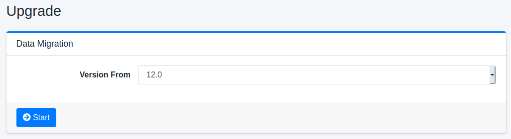

=======
Upgrade
=======

Overview
====

Upgrade page provides data migration tools for previous versions of |Fess|.

|image0|

This page is not in a menu pane.
To display this page, type /admin/upgrade/ to URL.

Operations
========

Backup
------

Download the configuration backup files below on Backup page before executing a migration process.

- .fess_basic_config.bulk
- .fess_user.bulk
- system.properties

Get the following file.

- app/WEB-INF/classes/fess_config.properties

Migration
---------

Type /admin/upgrade/ to URL after logging in as admin user.
Select a target version and then click button to execute data migration process.

Target Version
::::::::::::::

|Fess| version from which you want to upgrade.

