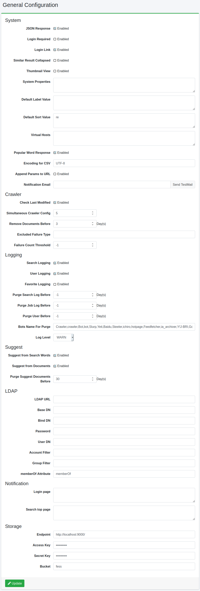

=====================
General Configuration
=====================

Overview
========

This administrative page manages configurations for |Fess|.
You can change |Fess|'s behavior without rebooting the |Fess|.

Management Operations
========

Display Configurations
----------------------

Select System > General in the left menu to display General Configuration page, as below.

|image0|

System
--------

JSON Response
:::::::::::::

Enable JSON response of Search features.

Login Required
::::::::::::::

Search pages are not displayed on Guest user if enabled.

Login Link
::::::::::

Login menu is displayed at the top of search pages if enabled.

Similar Result Collapsed
::::::::::::::::::::::::

Collapse similar results in search result page.

Thumbnail View
::::::::::::::

Display thumbnail images in search result page.

Default Label Value
:::::::::::::::::::

Specify default labels on search pages.
e.g. "role:admin=label1" is that users which has admin role use labels1 as default labels.

Default Sort Value
::::::::::::::::::

Specify default sort order on search pages.
e.g. "role:admin=content_length.desc" is that users which has admin role use content_length.desc as default sort order.

Virtual Hosts
:::::::::::::

Specify virtual hosts settings.
The format is REQUEST_HEADER_NAME:REQUEST_HEADER_VALUE=VIRTUAL_HOST_KEY.
(e.g. Host:fess.codelibs.org=fess)

Popular Word Response
:::::::::::::::::::::

Enable JSON response of Popular words.

Encoding for CSV
::::::::::::::::

This encoding is used in uploaded/downloaded CSV file.

Append Params to URL
::::::::::::::::::::

Append query parameters to URL of search results.

Notification Email
::::::::::::::::::

Specify e-mail address to send notification mail.

Crawler
-------

Check Last Modified
:::::::::::::::::::

Enable incremental crawling.
Crawler checks time stamp of a document at indexing time.

Simultaneous Crawler Config
:::::::::::::::::::::::::::

The number of Crawlers which deals with simultaneous crawling configuration.

Remove Documents Before
:::::::::::::::::::::::

Days which old documents are removed.
e.g. documents indexed X days ago are removed if they are not updated.

Excluded Failure Type
:::::::::::::::::::::

Crawler does not ignore failure URLs included in excluded failure types even if the failure count is over the threshold.

Failure Count Threshold
:::::::::::::::::::::::

Crawler ignores failure URLs of which failure count is over this threshold.

Logging
--------

Search Logging
::::::::::::::

Enable logging for user's searches.

User Logging
::::::::::::

Enable logging for users.

Favorite Logging
::::::::::::::::

Enable logging for favorite requests.

Purge Search Log Before
:::::::::::::::::::::::

Days which old search logs are removed.
To disable log purge, set to -1.

Purge Job Log Before
::::::::::::::::::::

Days which old job logs are removed.
To disable log purge, set to -1.

Purge User Before
:::::::::::::::::

Days which old user logs are removed.
To disable log purge, set to -1.

Bots Name For Purge
:::::::::::::::::::

Bots names to remove search logs.

Log Level
:::::::::

Log Level in fess.log.

Suggest
--------

Suggest from Search Words
:::::::::::::::::::::::::

Enable to generate suggested words from search logs.

Suggest from Documents
::::::::::::::::::::::

Enable to generate suggested words from indexed documents.

Purge Suggest Documents Before
::::::::::::::::::::::::::::::

Days which old suggested words are removed.

LDAP
--------

LDAP URL
::::::::

URL of LDAP server.

Base DN
:::::::

Base DN of LDAP environment.

Bind DN
:::::::

Bind DN of LDAP environment.

Password
::::::::

Password for Bind DN.

User DN
:::::::

User definition pattern for user login.

Account Filter
::::::::::::::

LDAP query to filter user accounts.

Group Filter
::::::::::::::::::

Specify the filter condition for the group.

memberOf Attribute
::::::::::::::::::

memberOf Attribute name.
memberOf if LDAP server is Active Directory.
Some other LDAP server is isMemberOf.

Notification
------------

Login page
::::::::::

Contents displayed on login page.

Search top page
:::::::::::::::

Contents displayed on search top page.

Example
=======

LDAP Configuration
------------------

.. tabularcolumns:: |p{3cm}|p{12cm}|
.. list-table:: LDAP/Active Directory Configuration
   :header-rows: 1

   * - Name
     - Value (LDAP)
     - Value (Active Directory)
   * - LDAP URL
     - ldap://SERVERNAME:389
     - ldap://SERVERNAME:389
   * - Base DN
     - cn=Directory Manager
     - dc=fess,dc=codelibs,dc=org
   * - Bind DN
     - uid=%s,ou=People,dc=fess,dc=codelibs,dc=org
     - manager@fess.codelibs.org
   * - User DN
     - uid=%s,ou=People,dc=fess,dc=codelibs,dc=org
     - %s@fess.codelibs.org
   * - Account Filter
     - cn=%s or uid=%s
     - (&(objectClass=user)(sAMAccountName=%s))
   * - Group Filter
     -
     - (member:1.2.840.113556.1.4.1941:=%s)
   * - memberOf
     - isMemberOf
     - memberOf

