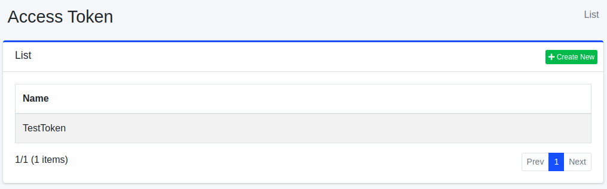

=============
Access Tokens
=============

Overview
========

The Access Tokens settings page allows you to manage access tokens.

Management Method
=================

Display Method
--------------

To open the list page for Access Token settings shown in the figure below, click [System > Access Tokens] in the left menu.

|image0|

To edit, click on the configuration name.

Creating a Configuration
------------------------

To open the Access Token settings page, click the "Create New" button.

|image1|

Configuration Items
===================

Name
::::

Specify a name to describe this access token.

Permissions
:::::::::::

Set the permissions for the access token.
They should be written in the "{user|group|role}name" format.
For example, if a user belonging to the "developer" group needs permission to view search results, set the permission as "{group}developer".

Parameter Name
::::::::::::::

Specify the request parameter name when using the permission as a search query.

Expired
:::::::

Specify the expiration date of the access token.

Deleting a Configuration
------------------------

Click on the configuration name on the list page, and then click the delete button. A confirmation screen will appear.
Clicking the delete button will remove the configuration.

.. |image1| image:: ../../../resources/images/en/14.10/admin/accesstoken-2.png

Please note that the image paths used in the document are placeholders and may need to be updated with the actual image paths.
