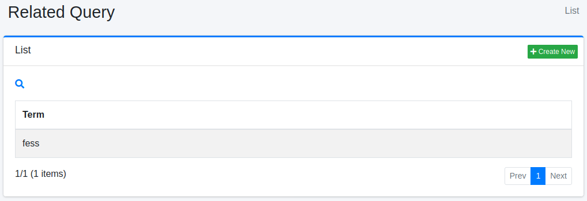

=============
Related Query
=============

Overview
========

Here, we will explain the settings for Related Queries. By configuring Related Queries settings, you can improve search results using registered related queries. Related queries can be used as alternative terms for search queries.

Management Methods
==================

Display Method
--------------

To open the list page for configuring Related Queries shown below, click on "[Crawler > Related Query]" in the left menu.

|image0|

To edit, click on the configuration name.

Creating Settings
-----------------

To open the Related Queries settings page, click on the "Create New" button.

|image1|

Setting Items
-------------

Term
::::

Specify the search term that you want to match with the search query.

Queries
:::::::

Specify the query.

Virtual Host
::::::::::::

Specify the hostname of the virtual host. For more information, refer to the :doc:`Virtual Host section of the configuration guide <../config/virtual-host>`.

Deleting Settings
-----------------

Click on the configuration name on the list page, and when the delete button is clicked, a confirmation screen will appear. Clicking the delete button will remove the configuration.

.. |image1| image:: ../../../resources/images/en/14.10/admin/relatedquery-2.png